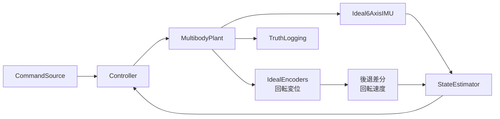

# 玉乗り3WDオムニローバー

`ball_balancing_omni3_multibody_lqi_custom_contact.slx` は、直径100 mm、質量285 gの薄肉球慣性を持つリジッド球、3個のNexus 14108オムニホイール、3個のDFRobot FIT0521エンコーダー付きDCモータ、2枚のCytron MDD3A、上部ロッドで構成する閉ループSimscape Multibodyモデルです。

## LQIモデル

`ball_balancing_omni3_multibody_lqi_custom_contact.slx` を現行の正式開発モデルとします。機体上部には質量0.50 kg、長さ300 mm、断面20 mm角のロッドを備え、ローバー総質量1.085 kg、球中心からの合成重心高約201 mmとしてLQIを設計します。

ボール―地面の `Spatial Contact Force` は維持し、ボール―3輪の接触力は次工程のcustom contact実装箇所として未接続にしています。各剛体、ホイール回転自由度、アクチュエータ、センサー、LQI制御系は維持しています。

旧モデルと `.original` バックアップは `old/` に保管しています。

## モデル階層



## MATLAB関数

| ファイル | モデル内の呼出元 | 役割 |
|---|---|---|
| `ballbotWheelGeometry.m` | パラメーター初期化 | 球面接触点、転動方向、車軸方向、トルク配分行列 |
| `ballbotCustomFriction.m` | `WheelBallContact` | 駆動方向とローラー方向を分離した接触摩擦 |
| `ballbotIdealImu.m` / `ballbotImuFromJoint.m` | `IdealIMU` | 6-DOF Joint真値から比力・角速度を生成 |
| `ballbotWheelRateFromDisplacement.m` | `EstimatorAndController` | 車輪回転変位を5 ms後退差分して回転速度を算出 |
| `ballbotEstimatorStep.m` | `StateEstimator` | IMU・エンコーダー融合、ボール回転・相対位置・ヨー軸ジャイロバイアス推定 |
| `ballbotYawBiasStartupGuard.m` | `Controller` | バイアス収束までヨー制御だけを抑止する準備完了ラッチ |
| `ballbotControlStep.m` | `Controller` | 速度外側ループ、姿勢内側ループ、ヨー速度制御 |
| `ballbotTorqueAllocator.m` | `Controller` | 一般化ボールトルクから3輪軸トルクへの配分 |
| `ballbotDcMotorTorqueEnvelope.m` | `Controller` | FIT0521のトルク―速度包絡線とMDD3Aの3 A連続電流制限 |
| `ballbotPoseFromJoint.m` | `TruthLogging` | 位置・クォータニオンからxyz/RPY真値を生成 |

推定器の内部状態は14要素で、末尾にヨー軸ジャイロバイアス推定値と低運動継続時間を保持します。制御器へ渡す`estimate(14)`の幅と順序は維持し、4～6番目をバイアス補正後の機体角速度とします。バイアス推定値、学習許可、継続時間は診断信号として扱います。起動時はバイアス収束までヨートルクだけを抑止し、明示的なヨー指令は抑止をバイパスします。

## 実行

```matlab
cd matlab_ws/ball_balancing_omni3
run_demo
```

`ballbotParameters.m` の `p.command.velocityWorld` と `p.command.yawRate` を変更して、ワールド座標の並進速度とヨー角速度を設定します。

## 100 mm球での検証結果

| シナリオ | 結果 |
|---|---|
| 静止、0.1 s | 全信号が有限。球―床接触は開始時から維持し、球―ホイール3点は約0.10 ms以内に成立して終了時まで維持 |
| 旧16007構成の標準コマンド、4 s | 有限値で完了。最大トルク0.03319 N·m、終了位置$x_W=1.678$ m、$y_W=0.00356$ m。FIT0521構成では再検証が必要 |
| パラメーター・幾何 | 100 mm、285 g、慣性対角成分$4.75\times10^{-4}$ kg·m$^2$、幾何行列rank=3を確認 |
| MATLAB単体試験 | パラメーター2件、ヨーバイアス16件の計18件が合格 |

既存の制御器・推定器ゲインは100 mm球向けに未調整です。速度追従ゲインとロバストネスは、実機のボール質量・摩擦実測値を反映して再調整します。

## 仕様

- [機構仕様](../../specs/hardware_design/mechanism/ball_balancing_omnirover3wd/README.md)
- [制御・状態推定仕様](../../specs/hardware_design/controll/ball_balancing_omnirover3wd/ball_balancing_omnirover3wd-system.md)
