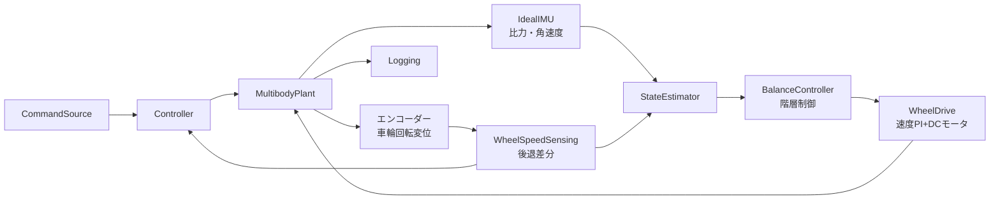

# 玉乗り3WDオムニローバー

`ball_balancing_omni3_multibody_lqi_custom_contact_fullplant.slx` は、直径100 mm、質量285 gの薄肉球、3個のNexus 14108オムニホイール、3個のDFRobot FIT0521エンコーダー付きDCモータ、2枚のCytron MDD3A、上部ロッドで構成する閉ループSimscape Multibodyモデルです。本モデルをシステムの正本とします。

## 正本モデル

`ball_balancing_omni3_multibody_lqi_custom_contact_fullplant.slx` を現行の正式開発モデルとします。機体上部には質量0.50 kg、長さ300 mm、断面20 mm角のロッドを備え、ローバー総質量1.085 kg、球中心からの合成重心高約201 mmとして設計します。

球―地面と3組のホイール―球はすべて `Spatial Contact Force` で接続し、ホイール―球接触は `ballbotCustomFriction.m` による異方性摩擦を `Provided by Input` で与えます。

パラメーターは `ballbotFullPlantParameters.m` が生成する構造体 `ballbotParams` をモデルワークスペースへ設定します。

## モデル階層



### Controller 内サブシステム

| サブシステム | 役割 | 主な内容 |
|---|---|---|
| `WheelSpeedSensing` | 車輪回転変位の後退差分で輪速を算出 | `WheelRateInputs`、`WheelRateCalculation`、`PreviousWheelDisplacement` |
| `StateEstimator` | 14状態推定器の更新と状態保持 | `EstimatorInputs`、`EstimatorUpdate`、`EstimatorStateMemory`、`SelectEstimate`、`SelectNextEstimatorState`、`SelectYawBiasDiagnostics` |
| `BalanceController` | 指令・推定値から3輪速度指令を生成 | `ControlInputs`、`LqiController`、`LqiFeedbackInputs`、`LqiFeedbackState`、`VelocityIntegralMemory`、`SelectMode`、`SelectWheelSpeedCommand`、`SelectYawBiasReady` |
| `WheelDrive` | 輪速PI＋MDD3A電圧制限＋DCモータで輪トルクを生成 | `SpeedPiMotorInputs`、`SpeedPiAndDcMotor`、`SelectMotorTorque`、`SelectNextSpeedIntegral`、`SpeedIntegralMemory` |

### MultibodyPlant 内サブシステム

| サブシステム | 役割 | 主な内容 |
|---|---|---|
| `Environment` | 世界座標・ソルバー・床面 | `World`、`SolverConfig`、`MechanismConfig`、`GroundFrame`、`GroundPlane` |
| `Ball` | 球剛体と球―床接触 | `BallFreeJoint`、`BallSolid`、`BallGroundContact`、位置・姿勢の物理信号計測 |
| `RoverChassis` | 機体・ペイロード・モータハウジング | `RoverFreeJoint`、`ChassisSolid`、`PayloadRodMount`＋`PayloadRod500g`、`Motor1..3Solid`、位置・加速度・角速度・姿勢の物理信号計測 |
| `WheelAssembly1..3` | 車輪回転自由度・車輪固体・輪―球接触 | `WheelNMount`、`WheelNJoint`、`WheelNSolid`、`WheelNBallContact`、回転変位・接触状態・法線力・すべりの計測変換 |

プラント直下には、輪トルク入力の `TorqueDemux`＋`Torque1..3ToPS`、IMU生成の `IdealIMU`＋`RoverImuMux`、真値生成の `RoverPoseCalculation`／`BallPoseCalculation`、各輪の `WheelNCustomFriction`＋`WheelNFrictionInputs`＋`WheelNRotationVector`（異方性摩擦の物理信号を各WheelAssemblyへ供給）、ログ用To Workspace、および `IMU`／`WheelDisplacement`／`RoverPose`／`BallPose`／`ContactStatus` の各出力ポートがあります。

## 制御構成

制御器は階層構造で、外側から順に速度追従・傾斜安定化・輪速制御の3層とします。

1. `ballbotLqiControllerUpdate` は `p.controller.fullplant.enabled` が真のとき `ballbotFullPlantHierarchyUpdate` へ委譲します。
2. 階層制御は、輪速から `wheelSpeedFromPlanarVelocity` の疑似逆行列で機体平面速度を再構成し、速度外側ループが加速度指令を平面加速度上限0.60 m/s²と最大傾斜4 degへ制限した後、傾斜比例＋角速度微分で平面輪速指令を生成します。
3. 3輪速度指令は `wheelSpeedFromPlanarVelocity` 行列で輪速へ変換し、`maximumWheelSpeedCommand` で飽和します。飽和時は速度積分器を前回値に保持します。
4. `ballbotSpeedPiMotorStep` は輪速PI（`ballbotMdd3aVoltageController`）で電圧を生成し、MDD3A供給電圧と3 A連続電流で制限した後、DCモータモデルで輪トルクへ変換します。トルクは `min(p.controller.tractionLimitedWheelTorque, p.controller.fullplant.motorTorqueLimit)` で制限します。

`p.controller.fullplant.enabled = false` の構成では、`ballbotLqiControllerUpdate` 内部の10状態MIMO LQI（状態：平面速度2・傾斜2・傾斜角速度2・ヨー角速度・輪速3）を直接適用します。LQIゲインは `ballbotDesignLqi.m` が設計し、`fullplant_lqi_design.mat` が存在すればその値を優先します。

## MATLAB関数

| ファイル | モデル内の呼出元 | 役割 |
|---|---|---|
| `ballbotFullPlantParameters.m` | パラメーター初期化 | 正本モデル用パラメーター `ballbotParams` を生成 |
| `ballbotParameters.m` | `ballbotFullPlantParameters` から呼出し | 幾何・モータ・接触・推定・制御の基礎パラメーター |
| `ballbotWheelGeometry.m` | パラメーター初期化 | 球面接触点、転動方向、車軸方向、輪速変換行列 |
| `ballbotDesignLqi.m` | パラメーター初期化 | 縮約10状態プラントのLQIゲイン設計 |
| `ballbotCommandProfile.m` | `CommandSource` | 時間窓付き速度・ヨー指令プロファイル |
| `ballbotCustomFriction.m` | `WheelAssembly/WheelContact` | 駆動方向とローラー方向を分離した異方性接触摩擦 |
| `ballbotIdealImu.m` / `ballbotImuFromJoint.m` | `MultibodyPlant/IdealIMU` | 6-DOF Joint真値から比力・角速度を生成 |
| `ballbotWheelRateFromDisplacement.m` | `Controller/WheelSpeedSensing` | 車輪回転変位を5 ms後退差分して回転速度を算出 |
| `ballbotEstimatorStep.m` / `ballbotEstimatorUpdate.m` | `Controller/StateEstimator` | IMU・エンコーダー融合、ボール回転・相対位置・ヨー軸ジャイロバイアス推定 |
| `ballbotEstimatorInitialState.m` | 初期値式 | 推定器14状態の初期値 |
| `ballbotYawBiasStartupGuard.m` | `BalanceController` 内関数から呼出し | バイアス収束までヨー制御だけを抑止する準備完了ラッチ |
| `ballbotLqiControllerUpdate.m` | `Controller/BalanceController/LqiController` | モード管理・ヨーガード付き輪速指令生成、階層制御への委譲 |
| `ballbotFullPlantHierarchyUpdate.m` | `ballbotLqiControllerUpdate` から呼出し | 速度外側ループ＋傾斜安定化＋輪速変換の階層制御 |
| `ballbotLqiFeedbackState.m` | `Controller/BalanceController` | LQIフィードバック状態ベクトルの組立て |
| `ballbotSpeedPiMotorStep.m` | `Controller/WheelDrive` | 輪速PI・MDD3A電圧制限・DCモータトルク |
| `ballbotMdd3aVoltageController.m` | `ballbotSpeedPiMotorStep` から呼出し | 輪速PIからMDD3A電圧と積分器更新を生成 |
| `ballbotPoseFromJoint.m` | `Logging` | 位置・クォータニオンからxyz/RPY真値を生成 |
| `ballbotRoverInitialPosition.m` | 初期値式 | ローバー初期高さの計算 |
| `ballbotEulerToQuaternion.m` | 補助 | オイラー角からクォータニオン変換 |

推定器の内部状態は14要素で、末尾にヨー軸ジャイロバイアス推定値と低運動継続時間を保持します。制御器へ渡す`estimate(14)`の幅と順序は維持し、4～6番目をバイアス補正後の機体角速度とします。バイアス推定値、学習許可、継続時間は診断信号として扱います。起動時はバイアス収束までヨートルクだけを抑止し、明示的なヨー指令は抑止をバイパスします。

## 実行

```matlab
cd matlab_ws/ball_balancing_omni3
p = ballbotFullPlantParameters;
assignin("base", "ballbotParams", p);
in = Simulink.SimulationInput( ...
    "ball_balancing_omni3_multibody_lqi_custom_contact_fullplant");
in = in.setModelParameter("StopTime", "4");
out = sim(in);
```

`ballbotFullPlantParameters.m` の `p.command.velocityWorld` と `p.command.yawRate` を変更するか、`p.command.profileEnabled = true` で時間窓付き指令プロファイルを有効にします。

## 検証状態

| シナリオ | 結果 |
|---|---|
| 静止・モジュール化後の回帰 | モジュール化前ベースラインと全ログ信号が共通時間グリッドで一致。最大相対差は摩擦力で約4e-3（可変ステップ誤差範囲） |
| モデル更新 | `Ctrl+D` 相当のモデル更新が成功（ode15s） |
| MATLAB単体試験 | `ballbotEstimatorStepTest` 16件、`ballbotParametersTest` 3件、`fullplantDesignArtifactsTest` 6件、`fullplantIdentificationEvidenceTest` 9件が合格 |
| `tests/run_fullplant_regression` | upright・x・yの3ケース合格。xy合成指令は接触維持限界域のためモジュール化後モデルで輪―球接触を一時喪失（再構成前モデルも最小法線力0.04 Nの限界域）。制御再調整後に回帰基準を再生成する |

100 mm球での長時間安定性・速度追従性能の検証は継続中です。既知の残課題と設計経緯は `FULLPLANT_LQI_INVESTIGATION.md` と `FULLPLANT_CUSTOM_CONTACT_CONTROL_REPORT.md` を参照してください。

## 仕様

- [機構仕様](../../specs/hardware_design/mechanism/ball_balancing_omnirover3wd/README.md)
- [制御・状態推定仕様](../../specs/hardware_design/controll/ball_balancing_omnirover3wd/ball_balancing_omnirover3wd-system.md)
