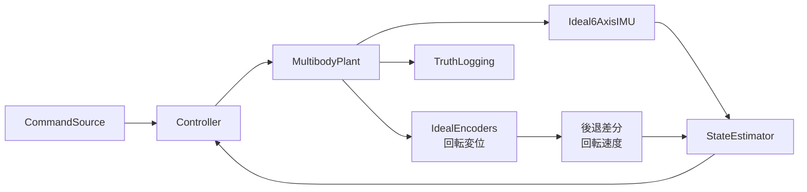

# 玉乗り3WDオムニローバー

`ball_balancing_omni3_multibody.slx` は、直径150 mmのゴムボール、3個のNexus 14108オムニホイール、3個のNexus 16007連続回転サーボで構成する閉ループSimscape Multibodyモデルです。

## モデル階層



## MATLAB関数

| ファイル | モデル内の呼出元 | 役割 |
|---|---|---|
| `ballbotWheelGeometry.m` | パラメーター初期化 | 球面接触点、転動方向、車軸方向、トルク配分行列 |
| `ballbotCustomFriction.m` | `WheelBallContact` | 駆動方向とローラー方向を分離した接触摩擦 |
| `ballbotIdealImu.m` / `ballbotImuFromJoint.m` | `IdealIMU` | 6-DOF Joint真値から比力・角速度を生成 |
| `ballbotWheelRateFromDisplacement.m` | `EstimatorAndController` | 車輪回転変位を5 ms後退差分して回転速度を算出 |
| `ballbotEstimatorStep.m` | `StateEstimator` | IMU・エンコーダー融合、ボール回転・相対位置推定 |
| `ballbotControlStep.m` | `Controller` | 速度外側ループ、姿勢内側ループ、ヨー速度制御 |
| `ballbotTorqueAllocator.m` | `Controller` | 一般化ボールトルクから3輪軸トルクへの配分 |
| `ballbotServoTorqueEnvelope.m` | `Controller` | Nexus 16007のトルク―速度包絡線 |
| `ballbotPoseFromJoint.m` | `TruthLogging` | 位置・クォータニオンからxyz/RPY真値を生成 |

## 実行

```matlab
cd matlab_ws/ball_balancing_omni3
run_demo
```

`ballbotParameters.m` の `p.command.velocityWorld` と `p.command.yawRate` を変更して、ワールド座標の並進速度とヨー角速度を設定します。

## 確認済みシナリオ

| シナリオ | 結果 |
|---|---|
| 静止、0.1 s | 4接触維持、最大傾斜0.00001 deg未満、有限値 |
| $v_x=0.03$ m/s、$v_y=0.02$ m/s、$r=0.20$ rad/s、0.5 s | 4接触維持、最大傾斜0.787 deg、平均ヨー速度0.183 rad/s、最大輪速1.403 rad/s |
| MATLAB関数 | 幾何ランク、摩擦散逸、サーボ包絡線、静止推定・制御のアサーション通過 |

速度追従ゲインとロバストネスは、実機のボール質量・摩擦実測値を反映して再調整します。

## 仕様

- [機構仕様](../../specs/hardware_design/mechanism/ball_balancing_omnirover3wd/README.md)
- [制御・状態推定仕様](../../specs/hardware_design/controll/ball_balancing_omnirover3wd/ball_balancing_omnirover3wd-system.md)
