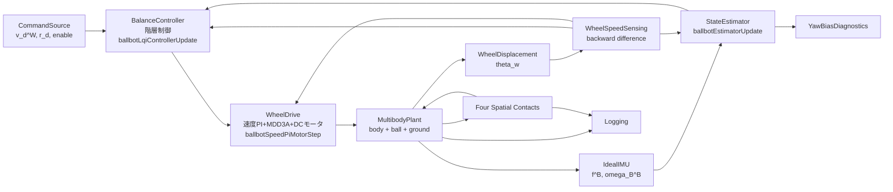
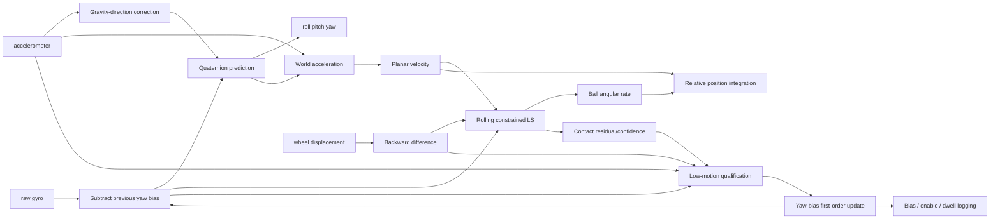
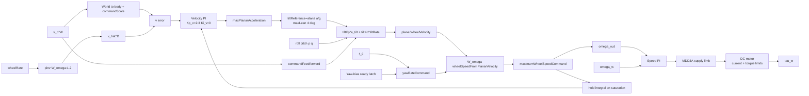

# 玉乗り3WDオムニローバー制御・推定アーキテクチャ

## 状態

| 項目 | 値 |
|---|---|
| ステータス | 実装中 |
| 最終更新日 | 2026-09-09 |
| 親仕様 | [システム仕様](ball_balancing_omnirover3wd-system.md) |

## 1. 機能分解



## 2. モデル階層

```text
ball_balancing_omni3_multibody_lqi_custom_contact_fullplant.slx
├── CommandSource                          % ballbotCommandProfile
├── Controller
│   ├── WheelSpeedSensing                  % 輪速検出
│   │   ├── WheelRateInputs                %   変位・前回値の束ね
│   │   ├── WheelRateCalculation           %   ballbotWheelRateFromDisplacement
│   │   └── PreviousWheelDisplacement      %   前回変位メモリ
│   ├── StateEstimator                     % 14状態推定器
│   │   ├── EstimatorInputs                %   推定器入力の束ね
│   │   ├── EstimatorUpdate                %   ballbotEstimatorUpdate
│   │   ├── EstimatorStateMemory           %   14状態メモリ
│   │   ├── SelectEstimate                 %   14要素推定出力
│   │   ├── SelectNextEstimatorState       %   次回状態
│   │   └── SelectYawBiasDiagnostics       %   診断3信号
│   ├── BalanceController                  % 輪速指令生成
│   │   ├── ControlInputs                  %   制御入力の束ね
│   │   ├── LqiController                  %   ballbotLqiControllerUpdate
│   │   │                                  %   （内部でballbotFullPlantHierarchyUpdateへ委譲）
│   │   ├── LqiFeedbackInputs              %   LQIフィードバック入力の束ね
│   │   ├── LqiFeedbackState               %   ballbotLqiFeedbackState
│   │   ├── VelocityIntegralMemory         %   速度積分2状態メモリ
│   │   ├── SelectMode                     %   制御モード取出し
│   │   ├── SelectNextVelocityIntegral     %   次回速度積分取出し
│   │   ├── SelectWheelSpeedCommand        %   輪速指令取出し
│   │   ├── SelectYawBiasReady             %   準備完了取出し
│   │   └── YawBiasReadyMemory             %   準備完了ラッチ
│   ├── WheelDrive                         % 輪駆動
│   │   ├── SpeedPiMotorInputs             %   指令・実輪速・積分・モードの束ね
│   │   ├── SpeedPiAndDcMotor              %   ballbotSpeedPiMotorStep
│   │   ├── SelectMotorTorque              %   輪トルク取出し
│   │   ├── SelectNextSpeedIntegral        %   次回積分取出し
│   │   └── SpeedIntegralMemory            %   速度PI積分メモリ
│   ├── ControlCycleDelay                  % 制御出力の1サンプル遅延
│   └── ControllerOutputMux / ControllerOutputDemux
├── MultibodyPlant
│   ├── Environment                        % World, SolverConfig,
│   │                                      % MechanismConfig, GroundFrame, GroundPlane
│   ├── Ball                               % BallFreeJoint, BallSolid,
│   │                                      % BallGroundContact, 位置・姿勢計測
│   ├── RoverChassis                       % RoverFreeJoint, ChassisSolid,
│   │                                      % PayloadRodMount+PayloadRod500g,
│   │                                      % Motor1..3Solid, 機体運動計測
│   ├── WheelAssembly1..3                  % WheelNMount, WheelNJoint, WheelNSolid,
│   │                                      % WheelNBallContact,
│   │                                      % 変位・接触状態・法線力・すべり計測
│   ├── TorqueDemux + Torque1..3ToPS       % 輪トルクの物理信号化
│   ├── IdealIMU + RoverImuMux             % ballbotImuFromJoint
│   ├── RoverPoseCalculation               % ballbotPoseFromJoint（機体真値）
│   ├── BallPoseCalculation                % ballbotPoseFromJoint（球真値）
│   └── WheelNCustomFriction               % ballbotCustomFriction
│       + WheelNFrictionInputs             %   ＋摩擦入力束ね
│       + WheelNRotationVector             %   ＋回転方向成形
└── Logging                                % Log* To Workspace
```

## 3. コンポーネントカタログ

| コンポーネント | 実装 | 入力→出力 | レート | DFT | 状態 |
|---|---|---|---:|---|---|
| CommandSource | Simulink Subsystem＋`ballbotCommandProfile.m` | 定数/プロファイル→$v_d^W,r_d,enable$ | 5 ms | Yes | なし |
| WheelSpeedSensing | `ballbotWheelRateFromDisplacement.m`＋Memory | $\theta_w[k],\theta_w[k-1]\rightarrow\omega_w[k]$ | 5 ms | Yes | 前回変位3 |
| StateEstimator | `ballbotEstimatorUpdate.m`→`ballbotEstimatorStep.m`＋Memory＋Selector | IMU,輪速→$\hat z$(14)、診断3信号 | 5 ms | Partial | 推定14状態 |
| BalanceController | `ballbotLqiControllerUpdate.m`→`ballbotFullPlantHierarchyUpdate.m`＋`ballbotLqiFeedbackState.m`＋Memory＋Selector | $\hat z$,指令,輪速,診断→輪速指令(3),mode,ready | 5 ms | Partial | 速度積分2・準備完了1 |
| WheelDrive | `ballbotSpeedPiMotorStep.m`→`ballbotMdd3aVoltageController.m`＋DCモータ式＋Memory | 輪速指令,実輪速,mode→$\tau_w$(3) | 5 ms | Partial | 速度PI積分3 |
| ControlCycleDelay | Unit Delay | 制御出力→1サンプル前の出力 | 5 ms | No | 代数ループ分離 |
| Environment | World Frame＋Solver Configuration＋Mechanism Configuration＋Infinite Plane | 基準座標・重力・床面 | 連続 | No | なし |
| Ball | Spherical Solid＋6-DOF Joint＋Spatial Contact Force | 接触力→球6DoF | 連続 | No | 球状態 |
| RoverChassis | Simscape Multibody剛体＋6-DOF Joint | 接触・輪反力→機体6DoF | 連続 | No | 剛体状態 |
| WheelAssembly1..3 | Revolute Joint＋Solid＋Spatial Contact Force | 輪トルク→車輪運動 | 連続 | No | 車輪状態 |
| BallGroundContact | Spatial Contact Force | 球・床幾何→接触力 | 連続 | Yes | ペナルティ接触 |
| WheelNBallContact | Spatial Contact Force＋`ballbotCustomFriction.m` | 幾何・すべり→異方性接触力 | 連続 | Yes | ペナルティ接触 |
| IdealIMU | `ballbotImuFromJoint.m`→`ballbotIdealImu.m` | 機体運動→比力・角速度 | 連続→5 ms | Yes | なし |
| WheelDisplacement | Revolute Joint position sensing＋PS-Simulink変換 | 車輪運動→$\theta_w$ | 連続→5 ms | Yes | なし |
| Logging | To Workspace | 真値・制御信号→timeseries | 連続/5 ms | Yes | ログのみ |

## 4. 物理プラント

### 4.1 一般化運動方程式

$$
M(q)\ddot q+C(q,\dot q)\dot q+g(q)
=S^T\tau_w+J_c(q)^TF_c
$$

| 記号 | 定義 |
|---|---|
| $q$ | 機体、ボール、3輪のMultibody一般化座標 |
| $S$ | 3輪Revolute Jointの入力選択行列 |
| $J_c$ | 球–床と3組の輪–球の接触ヤコビアン |
| $F_c$ | 法線力と接線摩擦力 |

### 4.2 ペナルティ接触

$$
F_n=s(d,w)\max(k_nd+c_n\dot d,0)
$$

$$
F_{t,d}=-\mu_dF_n\tanh\left(\frac{v_d}{v_c}\right),\qquad
F_{t,r}=-\mu_rF_n\tanh\left(\frac{v_r}{v_c}\right)
$$

| 接触 | $\mu_d$ | $\mu_r$ | 実装 |
|---|---:|---:|---|
| ホイール–ボール | 0.75 | 0.02 | `ballbotCustomFriction.m` |
| ボール–床 | 0.80 | 0.80 | Smooth Stick-Slip |

### 4.3 球面駆動トルク

$$
{}^B\tau_b=A_\tau\tau_w,\qquad
A_\tau=\frac{R_b}{R_w}
\begin{bmatrix}{}^Ba_1&{}^Ba_2&{}^Ba_3\end{bmatrix}
$$

$\lambda=45$ deg、$\beta_i=[0,120,240]$ degで $\operatorname{rank}(A_\tau)=3$。

## 5. 状態推定

| 推定器状態 | 次元 | 更新 |
|---|---:|---|
| $q_{WB}$ | 4 | ジャイロ積分+重力方向補正 |
| ${}^Wv_B$ | 3 | 比力のワールド変換と積分、平面拘束 |
| ${}^W\omega_K$ | 3 | 車輪回転変位の微分値・機体速度・球転がり拘束の正則化最小二乗 |
| ${}^Bp_{B/K,xy}$ | 2 | 機体速度–球中心速度の積分 |
| $\hat b_{g,z}$ | 1 | 認定済み低運動区間だけ一次遅れ更新、飽和・更新量制限 |
| $t_{qual}$ | 1 | 低運動候補の連続成立時間、候補不成立で0 |



同一サンプル内の順序は、前回バイアスによるジャイロ補正、姿勢・運動学・接触信頼度の計算、低運動判定、次回用バイアス更新とする。`BIAS --> SUB`は1サンプル状態を介するため、代数ループを形成しない。

## 6. 制御

制御器は輪速指令を生成する外側層と、輪速を輪トルクへ変換する内側層の階層構造とする。



起動直後は`YawBiasReadyMemory=0`とし、$\gamma=1$かつ$|\hat r|\le0.002$ rad/sで1へラッチする。ラッチ前はヨー速度指令だけを0とし、速度追従と傾斜安定化は動作を継続する。明示的な非ゼロヨー指令は起動抑止をバイパスするが、車輪運動によりバイアス学習条件は不成立となる。

### 6.1 階層制御の信号流れ

| 段 | 計算 | 実装 |
|---|---|---|
| モード管理 | FALLEN/RECOVERY/BALANCEとヨーバイアス準備完了ラッチ | `ballbotLqiControllerUpdate`→`ballbotYawBiasStartupGuard` |
| 機体速度再構成 | $\hat v^B=\operatorname{pinv}(W_\omega(:,1{:}2))\,\omega_w$ | `ballbotFullPlantHierarchyUpdate` |
| 速度外側ループ | $a_d=K_{p,v}e_v+K_{i,v}I_v$、$\|a_d\|\le0.60$ m/s² | 同上 |
| 傾斜指令 | $\alpha_d=\operatorname{atan2}(a_d,g)$、$\|\alpha_d\|\le4$ deg | 同上 |
| 傾斜安定化 | $u_{planar}=K_{p,\alpha}e_\alpha+K_{d,\alpha}\dot\alpha-K_{ff}v_d^B$ | 同上 |
| 輪速変換 | $\omega_{w,d}=W_\omega[u_{planar};r_d]$、飽和 | 同上 |
| 輪速制御 | 輪速PI→電圧→電流・トルク制限 | `ballbotSpeedPiMotorStep` |

### 6.2 フィードバック極性

| 偏差 | 正の状態 | 必要な球運動 | 制御式の向き |
|---|---|---|---|
| $\theta-\theta_d>0$ | 機体上端が$+X_B$へ傾斜 | 球を$+X_B$側へ転がす | `tiltKp`正、`stabilizationSign=+1` |
| $\phi-\phi_d>0$ | 機体上端が$-Y_B$へ傾斜 | 球を$-Y_B$側へ転がす | 状態は$[-roll]$で統一 |
| $r_d-r>0$ | 正ヨー速度不足 | 3輪を同相に回す | $W_\omega$第3列の正ヨー項 |

### 6.3 アンチワインドアップ

| 条件 | 速度積分器 |
|---|---|
| 非飽和かつBALANCE | $I_v^+=\operatorname{sat}(I_v+T_se_v)$、±0.20 |
| 輪速指令が飽和 | 前回値を保持 |
| RECOVERY/FALLEN/DISABLED | 0へリセット |

RECOVERYでは傾斜指令を0へ強制し、FALLEN/DISABLEDでは輪速指令を0へ強制する。

### 6.4 代替パス（10状態LQI）

`p.controller.fullplant.enabled=false` の構成では、`ballbotLqiControllerUpdate` 内部の10状態MIMO LQIを直接適用する。状態は$[v_x,v_y,\theta,-\phi,q,-p,r,\omega_{w,1..3}]^T$で、輪速指令は
$\omega_{w,d}=u_{ff}-Kx-\lambda_K K_i I_v$
とし、飽和差分を$\operatorname{pinv}(W_\omega)$で積分器へ戻すアンチワインドアップを備える。ゲインは`ballbotDesignLqi.m`が縮約プラントの線形化から設計する。

## 7. 数値設計

| 懸念 | 対策 |
|---|---|
| 接触剛性による高速モード | 最大ステップ$10^{-4}$ s、接触遷移幅$5\times10^{-4}$ m |
| 接触開始時の不連続 | Smooth Spring-Damper、ゼロクロス検出 |
| 接触摩擦DFTループ | 接触ブロックの物理信号解法に閉じ、離散制御ループはUnit Delayで分離 |
| 推定最小二乗の特異性 | $H^TH+10^{-8}I$ |
| クォータニオンノルム | 毎ステップ正規化 |
| 加速中の重力方向誤補正 | $\lvert\|f\|-g\rvert\le0.25g$ のときのみ補正 |
| 一時停止によるバイアス誤学習 | 5条件の連続0.50 s成立後だけ更新 |
| 閾値近傍のチャタリング | 認定後に1.25倍の退出側閾値と接触信頼度0.70を使用 |
| 旋回・すべり中の誤学習 | 車輪角速度と接触信頼度で即時停止し、バイアスを保持 |
| バイアス外れ値 | ±0.10 rad/s飽和と$1.0\times10^{-4}$ rad/s/サンプル更新制限 |

## 8. パラメーター管理

| 項目 | 方針 |
|---|---|
| 格納 | `ballbotFullPlantParameters.m` が構造体 `p` を生成（基礎値は `ballbotParameters.m`） |
| モデル変数 | `ballbotParams` |
| チューニング可能 | 接触摩擦、推定ゲイン、低運動閾値、バイアス時定数・上限・準備完了閾値、速度外側ループ（`fullplant.velocityKp/Ki`）、傾斜安定化（`fullplant.tiltKp/tiltKd`）、輪速PI（`motor.speedControllerKp/Ki`）、LQI重み・飽和、制限値 |
| 固定 | 座標系、3輪番号、行列の符号規約 |
| 設計済みゲイン | `ballbotDesignLqi.m` が起動時に再計算。`fullplant_lqi_design.mat` が存在すれば `stateGain`・`integralGain`・`trackingGainScale` を上書き |

## 9. 既知の制約

| 制約 | 影響 |
|---|---|
| 絶対位置と絶対ヨーは外部基準なし | 長時間ドリフトを閉ループで除去できない |
| エンコーダーは絶対ヨーを観測しない | バイアス補正後もヨー角は初期値からの積分値 |
| 走行中の機体ヨーとボール回転は常時分離不能 | 走行中はバイアスを学習せず前回値を保持 |
| 接触信頼度は残差由来 | 4接触の個別分離を一意に識別しない |
| ボール質量・摩擦は仮値 | 実測後に再同定・再調整が必要 |
| オムニローラーを等価摩擦化 | 8ローラー切替による振動を再現しない |

## 付録A. 関連文書

- [システム仕様](ball_balancing_omnirover3wd-system.md)
- [状態方程式](ball_balancing_omnirover3wd-state-equations.md)
- [LQI制御理論](ball_balancing_omnirover3wd_lqi_theory.md)
- [制御・状態推定理論](ball_balancing_omnirover3wd-control-estimation-theory.md)
- [実装計画](ball_balancing_omnirover3wd-implementation-plan.md)
- [検証計画](ball_balancing_omnirover3wd-test-plan.md)

## 付録B. API検証メモ

| API/ブロック | 確認内容 | 根拠 |
|---|---|---|
| Spatial Contact Force | 球/凸形状、Infinite Plane、分離、法線ペナルティ、Provided by Input摩擦、接触量出力 | [MathWorks公式](https://www.mathworks.com/help/sm/ref/spatialcontactforce.html) |
| Transform Sensor | 相対フレーム運動の理想計測 | [MathWorks Multibody Dynamics](https://www.mathworks.com/help/sm/multibody-dynamics.html) |
| `Simulink.SimulationInput` | StopTime等をモデル非破壊で上書き | 本ワークスペースのシミュレーション実行方法 |
| `ballbotWheelGeometry` | $A_\tau$のランク3 | MATLAB R2026aで実行確認 |
| `ballbotEstimatorStep` | 静止入力で状態変化0、接触信頼度1 | MATLAB R2026aで実行確認 |
| `ballbotEstimatorStepTest` | バイアス学習・抑止・上限・再開・起動ガード・インターフェース回帰 | MATLAB R2026aで16件合格 |
| `Simulink.BlockDiagram.createSubsystem` | 信号線と物理接続の境界ポートを自動生成 | モジュール化で使用 |
| モデル更新 | `SimulationCommand=update` が ode15s で成功 | モジュール化後に確認 |
