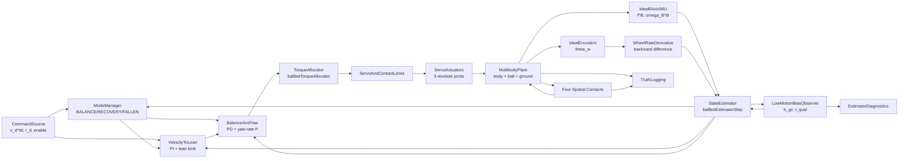
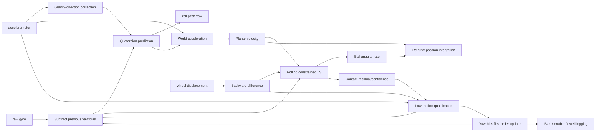
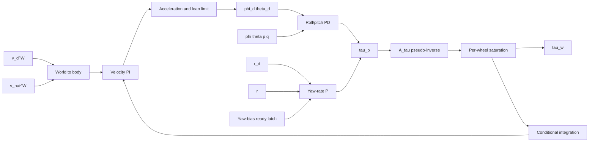

# 玉乗り3WDオムニローバー制御・推定アーキテクチャ

## 状態

| 項目 | 値 |
|---|---|
| ステータス | 実装中 |
| 最終更新日 | 2026-09-01 |
| 親仕様 | [システム仕様](ball_balancing_omnirover3wd-system.md) |

## 1. 機能分解



## 2. モデル階層

```text
ball_balancing_omni3_multibody.slx
├── CommandSource
├── Controller
│   ├── EstimatorAndController
│   │   ├── ballbotClosedLoopStep
│   │   ├── ballbotWheelRateFromDisplacement
│   │   ├── ballbotEstimatorStep
│   │   ├── YawBiasDiagnostics
│   │   ├── ballbotYawBiasStartupGuard
│   │   ├── YawBiasReadyMemory
│   │   ├── ballbotControlStep
│   │   ├── ballbotTorqueAllocator
│   │   └── ballbotServoTorqueEnvelope
│   └── ControlCycleDelay
├── MultibodyPlant
│   ├── Environment
│   │   ├── WorldFrame
│   │   ├── MechanismConfiguration
│   │   └── GroundPlane
│   ├── Ball
│   │   ├── SphericalSolid
│   │   └── BallGroundContact
│   ├── RoverMechanism
│   │   ├── ChassisAndIMUFrame
│   │   └── WheelModule_1..3
│   ├── WheelBallContact_1..3
│   │   └── ballbotCustomFriction
│   └── Sensors
│       ├── Ideal6AxisIMU
│       ├── IdealEncoders
│       └── TruthSensors
└── Logging
```

## 3. コンポーネントカタログ

| コンポーネント | 実装 | 入力→出力 | レート | DFT | 状態 |
|---|---|---|---:|---|---|
| CommandSource | Simulink Subsystem | 定数/テスト信号→$v_d^W,r_d,enable$ | 5 ms | Yes | なし |
| EstimatorAndController | MATLAB Function | IMU,車輪回転変位,指令→$\hat z,\tau_w,mode$、診断3信号 | 5 ms | Partial | 推定14状態・積分2状態・前回車輪回転変位3状態・ヨーバイアス準備完了1状態 |
| WheelRateDerivative | `ballbotWheelRateFromDisplacement.m` | $\theta_w[k],\theta_w[k-1]\rightarrow\omega_w[k]$ | 5 ms | Yes | 前回値は呼出元で保持 |
| ControlCycleDelay | Unit Delay | 18要素制御出力→1サンプル前の出力 | 5 ms | No | 代数ループ分離 |
| TorqueAllocator | `ballbotTorqueAllocator.m` | $\tau_b^B\rightarrow\tau_w$ | 5 ms | Yes | なし |
| ServoActuators | トルク―速度包絡線+3組のRevolute Joint | $\tau_w\rightarrow$車輪運動 | 5 ms→連続 | No | 車輪角速度 |
| RoverMechanism | Simscape Multibody | 接触力・反力→機体/車輪6DoF | 連続 | No | 剛体状態 |
| Ball | Simscape Multibody | 接触力→球6DoF | 連続 | No | 球位置・姿勢・速度 |
| BallGroundContact | Spatial Contact Force | 球・床幾何→接触力 | 連続 | Yes | ペナルティ接触 |
| WheelBallContact | Spatial Contact Force + MATLAB Function | 幾何・すべり→異方性接触力 | 連続 | Yes | ペナルティ接触 |
| Ideal6AxisIMU | 6-DOF Joint sensing + MATLAB Function | 機体運動→比力・角速度 | 連続→5 ms | Yes | なし |
| IdealEncoders | Revolute Joint position sensing | 車輪運動→$\theta_w$ | 連続→5 ms | Yes | なし |
| TruthLogging | To Workspace | 真値→timeseries | 連続 | Yes | ログのみ |

## 4. 物理プラント

### 4.1 一般化運動方程式

$$
M(q)\ddot q+C(q,\dot q)\dot q+g(q)
=S^T\tau_w+J_c(q)^TF_c
$$

| 記号 | 定義 |
|---|---|
| $q$ | 機体、ボール、3輪のMultibody一般化座標 |
| $S$ | 3輪Revolute Jointの入力選択行列 |
| $J_c$ | 球–床と3組の輪–球の接触ヤコビアン |
| $F_c$ | 法線力と接線摩擦力 |

### 4.2 ペナルティ接触

$$
F_n=s(d,w)\max(k_nd+c_n\dot d,0)
$$

$$
F_{t,d}=-\mu_dF_n\tanh\left(\frac{v_d}{v_c}\right),\qquad
F_{t,r}=-\mu_rF_n\tanh\left(\frac{v_r}{v_c}\right)
$$

| 接触 | $\mu_d$ | $\mu_r$ | 実装 |
|---|---:|---:|---|
| ホイール–ボール | 0.75 | 0.02 | `ballbotCustomFriction.m` |
| ボール–床 | 0.80 | 0.80 | Smooth Stick-Slip |

### 4.3 球面駆動トルク

$$
{}^B\tau_b=A_\tau\tau_w,\qquad
A_\tau=\frac{R_b}{R_w}
\begin{bmatrix}{}^Ba_1&{}^Ba_2&{}^Ba_3\end{bmatrix}
$$

$\lambda=45$ deg、$\beta_i=[0,120,240]$ degで $\operatorname{rank}(A_\tau)=3$。

## 5. 状態推定

| 推定器状態 | 次元 | 更新 |
|---|---:|---|
| $q_{WB}$ | 4 | ジャイロ積分+重力方向補正 |
| ${}^Wv_B$ | 3 | 比力のワールド変換と積分、平面拘束 |
| ${}^W\omega_K$ | 3 | 車輪回転変位の微分値・機体速度・球転がり拘束の正則化最小二乗 |
| ${}^Bp_{B/K,xy}$ | 2 | 機体速度–球中心速度の積分 |
| $\hat b_{g,z}$ | 1 | 認定済み低運動区間だけ一次遅れ更新、飽和・更新量制限 |
| $t_{qual}$ | 1 | 低運動候補の連続成立時間、候補不成立で0 |



同一サンプル内の順序は、前回バイアスによるジャイロ補正、姿勢・運動学・接触信頼度の計算、低運動判定、次回用バイアス更新とする。`BIAS --> SUB`は1サンプル状態を介するため、代数ループを形成しない。

## 6. 制御



起動直後は`YawBiasReadyMemory=0`とし、$\gamma=1$かつ$|\hat r|\le0.002$ rad/sで1へラッチする。ラッチ前はヨートルクだけを0とし、ロール・ピッチPDは動作を継続する。明示的な非ゼロヨー指令は起動抑止をバイパスするが、車輪運動によりバイアス学習条件は不成立となる。

### 6.1 フィードバック極性

| 偏差 | 正の状態 | 必要な球運動 | 制御式の符号 |
|---|---|---|---|
| $\phi-\phi_d>0$ | 機体上端が$-Y_B$へ傾斜 | 球を$-Y_B$へ加速 | $\tau_{b,x}>0$ |
| $\theta-\theta_d>0$ | 機体上端が$+X_B$へ傾斜 | 球を$+X_B$へ加速 | $\tau_{b,y}>0$ |
| $r_d-r>0$ | 正ヨー速度不足 | 機体へ$+Z_B$反力 | $\tau_{b,z}<0$ |

### 6.2 アンチワインドアップ

| 条件 | 速度積分器 |
|---|---|
| 全輪非飽和かつBALANCE | $I_v^+=\operatorname{sat}(I_v+T_se_v)$ |
| いずれかの輪が飽和 | 前回値を保持 |
| RECOVERY/FALLEN/DISABLED | 0へリセット |

## 7. 数値設計

| 懸念 | 対策 |
|---|---|
| 接触剛性による高速モード | 最大ステップ$10^{-4}$ s、接触遷移幅$5\times10^{-4}$ m |
| 接触開始時の不連続 | Smooth Spring-Damper、ゼロクロス検出 |
| 接触摩擦DFTループ | 接触ブロックの物理信号解法に閉じ、離散制御ループはUnit Delayで分離 |
| 推定最小二乗の特異性 | $H^TH+10^{-8}I$ |
| クォータニオンノルム | 毎ステップ正規化 |
| 加速中の重力方向誤補正 | $\lvert\|f\|-g\rvert\le0.25g$ のときのみ補正 |
| 一時停止によるバイアス誤学習 | 5条件の連続0.50 s成立後だけ更新 |
| 閾値近傍のチャタリング | 認定後に1.25倍の退出側閾値と接触信頼度0.70を使用 |
| 旋回・すべり中の誤学習 | 車輪角速度と接触信頼度で即時停止し、バイアスを保持 |
| バイアス外れ値 | ±0.10 rad/s飽和と$1.0\times10^{-4}$ rad/s/サンプル更新制限 |

## 8. パラメーター管理

| 項目 | 方針 |
|---|---|
| 格納 | `ballbotParameters.m` が構造体 `p` を生成 |
| モデル変数 | `ballbotParams` |
| チューニング可能 | 接触摩擦、推定ゲイン、低運動閾値、バイアス時定数・上限・準備完了閾値、速度PI、姿勢PD、ヨーP、制限値 |
| 固定 | 座標系、3輪番号、行列の符号規約 |

## 9. 既知の制約

| 制約 | 影響 |
|---|---|
| 絶対位置と絶対ヨーは外部基準なし | 長時間ドリフトを閉ループで除去できない |
| エンコーダーは絶対ヨーを観測しない | バイアス補正後もヨー角は初期値からの積分値 |
| 走行中の機体ヨーとボール回転は常時分離不能 | 走行中はバイアスを学習せず前回値を保持 |
| 接触信頼度は残差由来 | 4接触の個別分離を一意に識別しない |
| ボール質量・摩擦は仮値 | 実測後に再同定・再調整が必要 |
| オムニローラーを等価摩擦化 | 8ローラー切替による振動を再現しない |

## 付録A. 関連文書

- [システム仕様](ball_balancing_omnirover3wd-system.md)
- [制御・状態推定理論](ball_balancing_omnirover3wd-control-estimation-theory.md)
- [実装計画](ball_balancing_omnirover3wd-implementation-plan.md)
- [検証計画](ball_balancing_omnirover3wd-test-plan.md)

## 付録B. API検証メモ

| API/ブロック | 確認内容 | 根拠 |
|---|---|---|
| Spatial Contact Force | 球/凸形状、Infinite Plane、分離、法線ペナルティ、Provided by Input摩擦、接触量出力 | [MathWorks公式](https://www.mathworks.com/help/sm/ref/spatialcontactforce.html) |
| Transform Sensor | 相対フレーム運動の理想計測 | [MathWorks Multibody Dynamics](https://www.mathworks.com/help/sm/multibody-dynamics.html) |
| `Simulink.SimulationInput` | StopTime等をモデル非破壊で上書き | 既存`matlab_ws/3wd_omnirover/run_demo.m` |
| `ballbotWheelGeometry` | $A_\tau$のランク3 | MATLAB R2026aで実行確認 |
| `ballbotEstimatorStep` | 静止入力で状態変化0、接触信頼度1 | MATLAB R2026aで実行確認 |
| `ballbotEstimatorStepTest` | バイアス学習・抑止・上限・再開・起動ガード・インターフェース回帰 | MATLAB R2026aで16件合格 |
