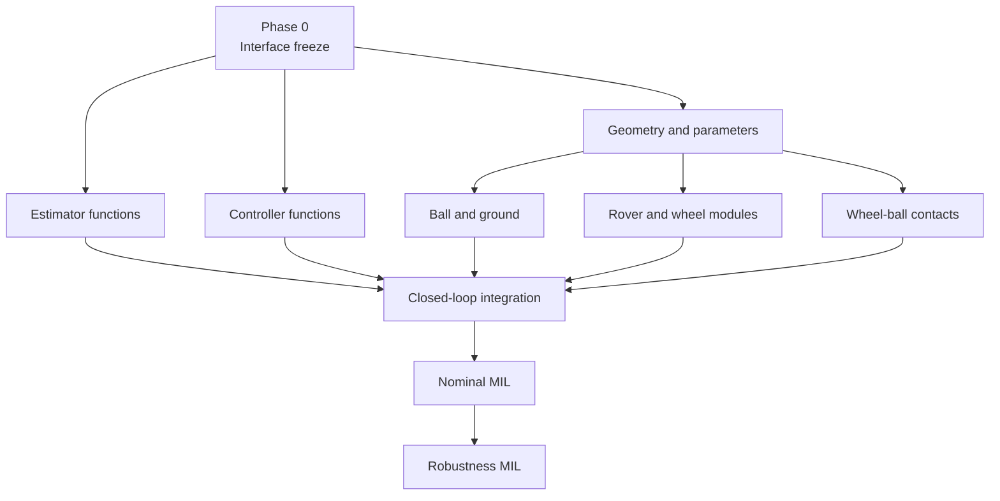

# 玉乗り3WDオムニローバー実装計画

## 状態

| 項目 | 値 |
|---|---|
| ステータス | 公称モデル実装・短時間MIL確認完了 |
| 最終更新日 | 2026-08-31 |
| アーキテクチャ | [アーキテクチャ仕様](ball_balancing_omnirover3wd-architecture.md) |
| 検証 | [検証計画](ball_balancing_omnirover3wd-test-plan.md) |

## 1. 進捗

| フェーズ | 状態 | 成果物 |
|---|---|---|
| 0. インターフェース固定 | 完了 | 座標系、信号、単位、符号、パラメーター |
| 1. MATLAB関数 | 完了 | 幾何、摩擦、IMU、推定、制御、配分 |
| 2. Multibodyプラント | 完了 | 球、床、3輪機構、4接触、異方性摩擦 |
| 3. 制御器統合 | 完了 | 状態推定・モード制御、5 ms制御遅延、サーボ包絡線 |
| 4. 閉ループ検証 | 短時間公称完了 | 静止、複合速度・ヨー指令 |
| 5. ロバストネス | 未完了 | 摩擦、球質量、ソルバー感度 |

## 2. 依存製品

| 製品 | 用途 | 必須 |
|---|---|---|
| MATLAB | パラメーター、MATLAB関数、解析 | Yes |
| Simulink | 制御器・ログ | Yes |
| Simscape | 物理信号 | Yes |
| Simscape Multibody | 剛体・ジョイント・接触 | Yes |
| Simulink Test | Gherkin/MIL自動化 | No。利用可能時に使用 |

## 3. フェーズ依存

## 4. ビルド手順

### Phase 0: インターフェース固定

| ID | 操作 | 完了条件 | 状態 |
|---|---|---|---|
| 0.1 | $W,B,K,F_i$座標系を固定 | 機構・制御文書で一致 | 完了 |
| 0.2 | 3輪番号と正方向を固定 | $\beta=[0,120,240]$ deg | 完了 |
| 0.3 | 14要素推定出力を固定 | システム仕様§5と一致 | 完了 |
| 0.4 | 5 ms離散インターフェースを固定 | 推定器・制御器で一致 | 完了 |

### Phase 1: MATLAB関数

| ID | 関数 | 確認 | 状態 |
|---|---|---|---|
| 1.1 | `ballbotParameters` | 全パラメーター有限、質量整合 | 完了 |
| 1.2 | `ballbotWheelGeometry` | 直交性、$\operatorname{rank}(A_\tau)=3$ | 完了 |
| 1.3 | `ballbotTorqueAllocator` | 往復誤差、飽和 | 完了 |
| 1.4 | `ballbotCustomFriction` | 摩擦がすべりと逆向き | 完了・3接触へ統合済み |
| 1.5 | `ballbotWheelRateFromDisplacement` | 車輪回転変位の後退差分 | 完了 |
| 1.6 | `ballbotEstimatorStep` | 静止不変、有限出力 | 完了 |
| 1.7 | `ballbotControlStep` | モード・符号・飽和 | 完了 |
| 1.8 | `ballbotServoTorqueEnvelope` | 最高輪速で加速トルク0 | 完了 |

### Phase 2: Multibodyプラント

| ID | 操作 | 検証ツール |
|---|---|---|
| 2.1 | 既存`omnirover3wd_multibody.slx`を新規フォルダーへ複製 | ファイル存在 |
| 2.2 | ルートをCommandSource/Controller/MultibodyPlant/Loggingへ分割 | `model_overview` |
| 2.3 | Infinite Planeと直径150 mm Spherical Solidを配置 | `model_read` |
| 2.4 | 球–床Spatial Contact Forceを接続 | `model_read`, `model_check` |
| 2.5 | 3輪中心を球面$\lambda=45$ degへ再配置 | Transform確認 |
| 2.6 | 3組のRevolute Jointを$+a_i$へ整列 | Joint軸確認 |
| 2.7 | 3組の輪–球Spatial Contact Forceを接続 | 物理ポート確認 |
| 2.8 | Provided by Input摩擦と`ballbotCustomFriction`を接続 | すべり/力ログ |
| 2.9 | IMU、車輪回転変位、truthセンサーを接続 | 信号次元確認 |

### Phase 3: 制御器統合

| ID | 操作 | 完了条件 |
|---|---|---|
| 3.1 | StateEstimatorをMATLAB Function+Unit Delayで構成 | 12状態、14出力 |
| 3.2 | ModeAndControlをMATLAB Function+Unit Delayで構成 | 2積分状態、3輪出力 |
| 3.3 | 輪トルクをRevolute Jointへ接続 | 正方向一致 |
| 3.4 | 速度・ヨー指令をCommandSourceへ接続 | 範囲制限一致 |
| 3.5 | truth信号を制御器から隔離 | 制御入力線なし |

### Phase 4: 閉ループ検証

| ID | シナリオ | ゲート |
|---|---|---|
| 4.1 | 静止直立 | 4接触維持、姿勢±1 deg |
| 4.2 | $v_x=0.10$ m/s | 速度誤差±0.01 m/s |
| 4.3 | $v_y=0.08$ m/s | 速度誤差±0.01 m/s |
| 4.4 | $r=0.5$ rad/s | ヨー速度誤差±0.05 rad/s |
| 4.5 | 初期傾斜10 deg | 2 s以内に±2 deg |

## 5. パラメーター表

| パラメーター | 値 | 単位 | 出典 | 実装 |
|---|---:|---:|---|---|
| $R_b$ | 0.075 | m | 要求 | `p.ball.radius` |
| $m_b$ | 0.300 | kg | 仮定・実測更新 | `p.ball.mass` |
| $R_w$ | 0.024 | m | 14108仕様書 | `p.wheel.radius` |
| $m_w$ | 0.039 | kg | 14108仕様書/既存モデル | `p.wheel.mass` |
| $m_R$ | 0.462 | kg | 既存3WDモデル | `p.rover.mass` |
| $\lambda$ | 45 | deg | 機構設計 | `p.wheel.contactLatitude` |
| $\tau_{servo,max}$ | 1.275 | N·m | 16007仕様書 | `p.servo.maxTorque` |
| $\tau_{contact,max}$ | 0.0384 | N·m | 公称法線荷重・摩擦 | `p.wheel.commandTorqueLimit` |
| $T_s$ | 0.005 | s | 制御設計 | estimator/controller |
| $K_{pv}$ | [2,2] | s$^{-1}$ | 初期調整値 | `p.controller.velocityKp` |
| $K_{iv}$ | [0.35,0.35] | s$^{-2}$ | 初期調整値 | `p.controller.velocityKi` |
| $K_{p,att}$ | [0.95,0.95] | N·m/rad | 初期調整値 | `p.controller.balanceKp` |
| $K_{d,att}$ | [0.12,0.12] | N·m/(rad/s) | 初期調整値 | `p.controller.balanceKd` |

## 6. 完了定義

- [x] 座標系・符号・単位を文書化
- [x] MATLAB関数をモデル外で静止入力確認
- [x] ルート階層がアーキテクチャと一致
- [x] `model_check`にerrorなし
- [x] 全モデルが更新・コンパイル可能
- [x] 静止シミュレーション完走
- [x] 短時間の複合速度・ヨー指令シナリオ完走
- [x] 4接触truthログを保存
- [ ] 規定速度での定常追従ゲート合格
- [ ] 接触分離シナリオと法線力・すべりログを保存
- [ ] ソルバー・摩擦・球質量の感度試験完了

### 6.1 実行済みMIL

| シナリオ | 主結果 | 判定 |
|---|---|---|
| 静止、0.1 s | 4接触、最大傾斜0.00001 deg未満、有限値 | 合格 |
| $[v_x,v_y,r]=[0.03,0.02,0.20]$、0.5 s | 4接触、最大傾斜0.787 deg、平均ヨー速度0.183 rad/s、最大輪速1.403 rad/s | 短時間ゲート合格 |
| モデル更新 | `ANISOTROPIC_COMPILE_OK` | 合格 |

## 7. リスク

| リスク | 検出 | 対策 |
|---|---|---|
| 接触モデルが硬くシミュレーション停止 | ソルバー診断 | 遷移幅、剛性、最大ステップを段階調整 |
| 車輪ローカル軸と摩擦方向が不一致 | 単輪正トルク試験 | $F_i$座標の軸を修正 |
| 反力符号が逆 | 1 deg姿勢偏差試験 | joint actuation signを1か所で反転 |
| 公称摩擦でトルク不足 | 飽和率 | 接触緯度・重心・指令範囲を再設計 |
| IMU速度積分ドリフト | truth誤差 | 実機版で外部速度補正を追加 |
