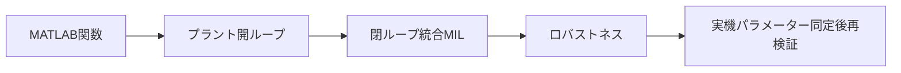

# 玉乗り3WDオムニローバー検証計画

## 状態

| 項目 | 値 |
|---|---|
| ステータス | ドラフト |
| 最終更新日 | 2026-08-31 |
| アーキテクチャ | [アーキテクチャ仕様](ball_balancing_omnirover3wd-architecture.md) |

## 1. 検証段階



| 段階 | 合格ゲート |
|---|---|
| A. MATLAB関数 | 幾何、配分、静止推定、制御符号 |
| B. プラント開ループ | 接触・重力・正トルクの運動方向 |
| C. 閉ループMIL | 静止、速度、ヨー、復帰 |
| D. ロバストネス | 摩擦・質量・ソルバー変動で有限・安定 |

## 2. MATLAB関数検証

| ID | 対象 | 入力 | 期待値 | 判定 |
|---|---|---|---|---|
| U-01 | WheelGeometry | 公称$p$ | $n_i,t_i,a_i$相互直交 | 内積$<10^{-12}$ |
| U-02 | WheelGeometry | 公称$p$ | $A_\tau$フルランク | rank=3 |
| U-03 | TorqueAllocator | $\tau_b=[0.01,-0.02,0.005]^T$ | 往復一致 | 非飽和時誤差$<10^{-9}$ N·m |
| U-04 | TorqueAllocator | 大トルク | 全輪飽和 | $|\tau_i|\le0.0384$ N·m |
| U-05 | CustomFriction | $v_t\ne0,F_n>0$ | $F_t^Tv_t\le0$ | 常に非正 |
| U-06 | WheelRateDerivative | 変位増分$[0.01,-0.02,0.03]^T$ rad、$T_s=5$ ms | 後退差分 | $[2,-4,6]^T$ rad/s、誤差$<10^{-12}$ rad/s |
| U-07 | Estimator | 静止IMU、車輪回転変位一定 | 状態不変・接触信頼度 | ノルム誤差$<10^{-10}$、信頼度$>0.99$ |
| U-08 | Controller | 静止推定、指令0 | BALANCE、$\tau_w=0$ | mode=1、誤差$<10^{-12}$ |
| U-09 | Controller | $\theta=+1$ deg | 復元球トルク | $\tau_{b,y}<0$ |
| U-10 | Controller | 傾斜40 deg | FALLEN | mode=0、$\tau_w=0$ |

## 3. プラント開ループ

### 3.1 接触静力学

| ID | 初期条件 | 入力 | 観測 | 合格条件 |
|---|---|---|---|---|
| P-01 | 公称直立 | 全輪0 N·m | 3輪法線力 | 各輪$2.14$ Nの±20% |
| P-02 | 公称直立 | 全輪0 N·m | 球–床法線力 | $(m_R+m_b)g$の±10% |
| P-03 | 公称直立 | 全輪0 N·m | 貫通量 | 各接触1 mm未満 |
| P-04 | 公称直立 | 全輪0 N·m | 接触信号 | 4接触すべて1 |

### 3.2 駆動符号

| ID | 入力 | 期待運動 | 合格条件 |
|---|---|---|---|
| P-05 | $\tau_b=[+0.01,0,0]^T$相当 | 球中心$-Y_W$加速 | $a_{K,y}<0$ |
| P-06 | $\tau_b=[0,+0.01,0]^T$相当 | 球中心$+X_W$加速 | $a_{K,x}>0$ |
| P-07 | $\tau_b=[0,0,-0.005]^T$相当 | 機体$+Z_W$ヨー加速 | $\dot r_B>0$ |

### 3.3 分離可能性

| ID | 初期条件 | 期待 | 合格条件 |
|---|---|---|---|
| P-08 | 機体zを+5 mm | 3輪が球から分離 | 3接触信号=0の区間あり |
| P-09 | ボールzを+5 mm | 球が床から分離 | 床接触信号=0の区間あり |

## 4. 閉ループMIL

| ID | 指令/初期条件 | 計測時間 | 指標 | 合格条件 |
|---|---|---:|---|---|
| C-01 | $v_d=0,r_d=0$ | 4 s | 姿勢 | 最終1 sで$|\phi|,|\theta|<1$ deg |
| C-02 | $v_x:0\to0.10$ m/s @1 s | 5 s | 速度 | 最終1 sで誤差<0.01 m/s |
| C-03 | $v_y:0\to0.08$ m/s @1 s | 5 s | 速度 | 最終1 sで誤差<0.01 m/s |
| C-04 | $r:0\to0.50$ rad/s @1 s | 5 s | ヨー速度 | 最終1 sで誤差<0.05 rad/s |
| C-05 | $v=[0.08,0.06]$, $r=0.3$ | 6 s | 複合追従 | 3軸すべて目標内 |
| C-06 | 初期$\phi=10$ deg | 4 s | 復帰 | 2 s以内に±2 deg |
| C-07 | 初期$\theta=20$ deg | 4 s | モード | RECOVERYを経てBALANCE |
| C-08 | 初期$\theta=40$ deg | 1 s | 安全 | FALLEN、トルク0 |

### 共通接触判定

| 指標 | 合格条件 |
|---|---|
| 3輪接触率 | 各輪99%以上 |
| 球–床分離時間 | 0 s |
| 輪–球すべりRMS | 0.03 m/s未満 |
| 車輪トルク | 全サンプルで±0.0384 N·m以内 |
| 車輪速度 | 連続定常で±5.55 rad/s以内 |

## 5. 推定精度

| ID | シナリオ | 推定量 | 合格条件 |
|---|---|---|---|
| E-01 | C-01 | ロール・ピッチ | RMS誤差<0.2 deg |
| E-02 | C-02 | 平面速度 | RMS誤差<0.02 m/s |
| E-03 | C-04 | ヨー角速度 | RMS誤差<0.02 rad/s |
| E-04 | C-02 | ボール角速度 | RMS誤差<0.2 rad/s |
| E-05 | 摩擦-20% | 接触信頼度 | すべり増加時に公称より低下 |

## 6. 飽和・アンチワインドアップ

| ID | 条件 | 回復入力 | 合格条件 |
|---|---|---|---|
| A-01 | $v_d=0.5$ m/sを1 s印加 | $v_d=0$ | 指令は0.12 m/sへ制限 |
| A-02 | A-01で輪トルク飽和 | $v_d=0$ | 積分器が飽和中に増加しない |
| A-03 | $r_d=2$ rad/s | $r_d=0$ | 指令は0.8 rad/sへ制限 |
| A-04 | BALANCE→RECOVERY | 傾斜18 deg超過 | 速度積分器0 |

## 7. 感度試験

| パラメーター | 公称 | 変動 | 再実行 | 合格条件 |
|---|---:|---:|---|---|
| ボール質量 | 0.300 kg | 0.20, 0.40 kg | C-01,C-02 | 転倒なし、誤差2倍以内 |
| 輪–球$\mu_d$ | 0.75 | 0.60, 0.90 | C-02,C-05 | 接触維持 |
| 球–床$\mu_d$ | 0.80 | 0.64, 0.96 | C-02 | 転倒なし |
| 機体質量 | 0.462 kg | ±10% | C-01,C-02 | 転倒なし |
| 接触緯度 | 45 deg | 40, 50 deg | C-01 | $A_\tau$ rank=3、接触維持 |
| IMU補正ゲイン | 2.5 | 1.25, 5.0 | E-01 | 有限、発散なし |

## 8. 数値ロバストネス

| ID | 変更 | 比較 | 合格条件 |
|---|---|---|---|
| N-01 | 最大ステップ$5\times10^{-5}$ s | C-01公称 | 最終姿勢差<0.2 deg |
| N-02 | 最大ステップ$2\times10^{-4}$ s | C-01公称 | 完走、最終姿勢差<0.5 deg |
| N-03 | RelTol$10^{-5}$ | C-02公称 | 最終速度差<0.005 m/s |
| N-04 | 代替ソルバー | C-01公称 | 完走、接触維持 |

## 9. ログ

| ログ名 | 内容 |
|---|---|
| `roverPose` | $x,y,z,\phi,\theta,\psi$ |
| `ballPose` | 球中心位置・姿勢 |
| `imuMeasurement` | 理想比力・角速度 |
| `wheelDisplacement` | エンコーダーが直接計測する3輪回転変位 |
| `wheelTorqueCommand` | 3輪トルク |
| `estimatedState` | 14要素推定出力 |
| `controllerMode` | 0/1/2 |
| `contactStatus` | 球–床+3輪–球 |
| `contactNormalForce` | 4接触法線力 |
| `contactSlip` | 4接触接線速度 |

## 10. 実行方法

```matlab
p = ballbotParameters;
in = Simulink.SimulationInput("ball_balancing_omni3_multibody");
in = in.setVariable("ballbotParams", p);
in = in.setModelParameter("StopTime", "4");
out = sim(in);
```
