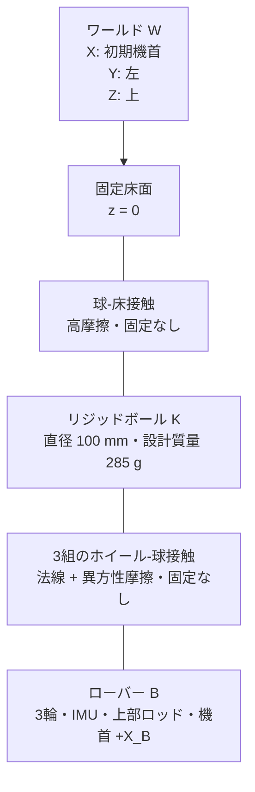
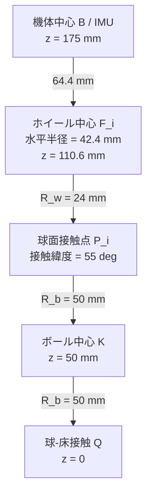

# 玉乗り3WDオムニローバー機構仕様

## システム構成

## 座標系

| 記号 | 原点 | 軸 |
|---|---|---|
| $W$ | 床面基準 | $+X_W$: 初期機首、$+Y_W$: 左、$+Z_W$: 上 |
| $B$ | 機体中央のIMU | $+X_B$: 機首、$+Y_B$: 左、$+Z_B$: 上 |
| $K$ | ボール中心 | 初期状態で $W$ と平行 |
| $F_i$ | ホイール $i$ 中心 | $+Z_{F_i}$: 車軸、$+X_{F_i}$: 駆動転動方向 |

## 初期配置

| 量 | 記号 | 値 | 単位 |
|---|---:|---:|---:|
| ボール半径 | $R_b$ | 0.050 | m |
| ホイール半径 | $R_w$ | 0.024 | m |
| ホイール接触緯度 | $\lambda$ | 55 | deg |
| ホイール方位角 | $\beta_i$ | 0, 120, 240 | deg |
| ボール中心から機体中心までの高さ | $h_B$ | 0.125 | m |
| 機体中心初期座標 | ${}^Wp_B$ | $[0,0,0.175]^T$ | m |
| 機体初期姿勢 | $[\phi_0,\theta_0,\psi_0]^T$ | $[0,0,0]^T$ | deg |
| 上部ロッド長さ | $L_p$ | 0.300 | m |
| 上部ロッド断面 | $w_p\times w_p$ | $0.020\times0.020$ | m |
| 上部ロッド中心の機体原点からの高さ | $h_p$ | 0.165 | m |
| ローバー合成重心の球中心からの高さ | $h_{COM}$ | 0.2010 | m |

$$
{}^Bn_i=
\begin{bmatrix}
\cos\lambda\cos\beta_i\\
\cos\lambda\sin\beta_i\\
\sin\lambda
\end{bmatrix},\quad
{}^Bt_i=
\begin{bmatrix}
-\sin\beta_i\\
\cos\beta_i\\
0
\end{bmatrix},\quad
{}^Ba_i={}^Bn_i\times{}^Bt_i
$$

$$
{}^Bp_{F_i}=(R_b+R_w){}^Bn_i-
\begin{bmatrix}0\\0\\h_B\end{bmatrix}
$$

| 派生寸法 | 値 |
|---|---:|
| ホイール中心の水平配置半径 $(R_b+R_w)\cos\lambda$ | 42.4 mm |
| ホイール中心のボール中心からの高さ $(R_b+R_w)\sin\lambda$ | 60.6 mm |
| ホイール中心の機体中心からの下がり量 | 64.4 mm |
| ホイール込み推定外接半径 | 66.5 mm |
| シャシー外接半径 | 70.0 mm |

## 構成部品

| 部位 | 採用品 | 数量 | 主要仕様 | モデル値の出典 |
|---|---|---:|---|---|
| ボール | リジッドボール XL（設計基準） | 1 | 直径100 mm、質量285 g、高グリップ表面 | 公開仕様。直径、質量、慣性、摩擦は入手後に実測 |
| オムニホイール | Nexus Robot 14108 | 3 | 直径48 mm、幅25.1 mm、8ローラー、約39–40 g、負荷上限2 kg | [14108仕様書](../omnirover3wd_reference/omniwheel_14108/nexus_14108_omniwheel_datasheet.pdf) |
| DCギヤードモータ | DFRobot FIT0521 | 3 | 6 V、210 rpm、10 kgf·cm、ストール3.2 A、52 × $\phi$24.4 mm、96 g | [DFRobot公式仕様](https://wiki.dfrobot.com/fit0521/) |
| モータドライバ | Cytron MDD3A | 2 | 2チャネル/枚、4–16 V、3 A連続・5 Aピーク/チャネル、PWM最大20 kHz、PWM/DIR入力 | [Cytron公式仕様](https://my.cytron.io/p-3amp-4v-16v-dc-motor-driver-2-channels) |
| IMU | 理想6軸IMU | 1 | 3軸比力、3軸角速度、機体中央配置 | シミュレーションセンサー |
| エンコーダー | FIT0521内蔵2相Hall | 3 | 3.3/5 V、出力軸341.2 PPR、各輪回転変位（回転速度は制御器内で微分） | DFRobot公式仕様。実機のカウント逓倍方式は受入試験で確定 |
| 上部ロッド | 角柱バラスト | 1 | 質量0.500 kg、長さ300 mm、断面20 mm角、機体上面中央へ剛体固定 | `ball_balancing_omni3_multibody_lqi_custom_contact.slx` の正式仕様 |

## 質量・慣性予算

| 構成 | 単体質量 | 数量 | 小計 |
|---|---:|---:|---:|
| 機体フレーム・電装・支持部 | 0.180 kg | 1 | 0.180 kg |
| FIT0521モータ | 0.096 kg | 3 | 0.288 kg |
| 14108ホイール | 0.039 kg | 3 | 0.117 kg |
| 上部ロッド | 0.500 kg | 1 | 0.500 kg |
| ローバー合計（MDD3A基板質量を除く） |  |  | 1.085 kg |
| 100 mmリジッドボール（設計基準） | 0.285 kg | 1 | 0.285 kg |

上部ロッドを含むローバー合成重心は機体原点から76.0 mm上方、球中心から201.0 mm上方に位置する。LQI設計にはこの合成重心高を使用し、ホイール配置には機体原点の幾何高さ125 mmを使用する。

$$
I_b=\frac{2}{3}m_bR_b^2I_3
=4.750\times10^{-4}I_3\ \mathrm{kg\,m^2}
$$

慣性は薄肉球殻を保守側の初期値としている。実物の内部質量分布を同定し、一様中実球相当$2.85\times10^{-4}I_3\ \mathrm{kg\,m^2}$との範囲で制御ロバスト性を確認する。

## 接触仕様

| 接触 | 法線モデル | 接線モデル | 分離 |
|---|---|---|---|
| ボール–床 | $F_n=s(d,w)(k_nd+c_n\dot d)$ | Smooth stick-slip、$\mu_s=0.90$、$\mu_d=0.80$ | 可能 |
| ホイール–ボール | $F_{n,i}=s(d_i,w)(k_nd_i+c_n\dot d_i)$ | 駆動方向 $\mu_d=0.75$、ローラー方向 $\mu_r=0.02$ | 可能 |

| パラメーター | ホイール–ボール | ボール–床 | 単位 |
|---|---:|---:|---:|
| 法線剛性 | $2.0\times10^5$ | $3.0\times10^5$ | N/m |
| 法線減衰 | 250 | 180 | N/(m/s) |
| 遷移幅 | $5.0\times10^{-4}$ | $5.0\times10^{-4}$ | m |
| 臨界すべり速度 | $5.0\times10^{-3}$ | $5.0\times10^{-3}$ | m/s |

## 駆動制約

$$
\tau_{motor,stall}=10\times\frac{9.80665}{100}=0.981\ \mathrm{N\,m}
$$

$$
\tau_{continuous}=\tau_{motor,stall}\frac{3.0}{3.2}=0.919\ \mathrm{N\,m}
$$

$$
N_{i,nom}=\frac{m_Rg}{3\sin\lambda}=4.329\ \mathrm{N},\qquad
\tau_{contact,max}=\mu_dN_{i,nom}R_w=0.0779\ \mathrm{N\,m}
$$

| 制約 | 下限 | 上限 | 支配要因 |
|---|---:|---:|---|
| 無負荷輪速 | -21.99 rad/s | 21.99 rad/s | FIT0521、210 rpm @ 6 V |
| 連続指令輪トルク | -0.919 N·m | 0.919 N·m | MDD3A 3 A連続定格をFIT0521のトルク定数へ換算 |
| 短時間軸トルク | -0.981 N·m | 0.981 N·m | FIT0521ストールトルク。連続運転には使用しない |
| PWM周波数 | 0 kHz | 20 kHz | MDD3A入力上限 |

## センサー・配線インターフェース

| ID | 位置 | 出力 | 単位 | 正方向 |
|---|---|---|---|---|
| IMU | $B$ 原点 | $[f_x,f_y,f_z,p,q,r]$ | m/s², rad/s | $B$ 軸右手系 |
| ENC1 | $F_1$ 車軸 | $\omega_1$ | rad/s | $+a_1$ |
| ENC2 | $F_2$ 車軸 | $\omega_2$ | rad/s | $+a_2$ |
| ENC3 | $F_3$ 車軸 | $\omega_3$ | rad/s | $+a_3$ |

MDD3Aは2チャネル品であるため、基板Aのチャネル1/2をM1/M2、基板Bのチャネル1をM3へ割り当て、基板Bのチャネル2は未使用とする。モータ電源は6 V、ロジックGND・エンコーダGND・MDD3A GNDは共通化する。各モータのPWMとDIRは独立信号とし、非常停止では全PWMを0へ設定する。

## 製作・受入条件

| ID | 条件 | 受入値 |
|---|---|---:|
| M-01 | 3輪方位角誤差 | ±0.5 deg以内 |
| M-02 | 接触緯度誤差 | ±1.0 deg以内 |
| M-03 | 3接触点の半径方向位置差 | 0.5 mm以内 |
| M-04 | IMU原点と機体幾何中心のずれ | 1.0 mm以内 |
| M-05 | 機首マーキングと $+X_B$ のずれ | ±0.5 deg以内 |
| M-06 | ボール直径 | 100 mm。3軸測定値と真球度を記録 |
| M-07 | ボール質量・慣性 | 組込み前に実測しモデル更新 |
| M-08 | 静止時3輪法線荷重差 | 平均の±10%以内 |
| M-09 | ホイール、締結部、配線を含む最大外形 | 直径140 mm程度以内 |
| M-10 | FIT0521出力軸1回転のエンコーダーカウント | 341.2 PPR公称値との誤差を記録し、x1/x2/x4デコード方式を確定 |
| M-11 | MDD3A連続電流 | 各使用チャネル3.0 A以下 |
| M-12 | 上部ロッド質量 | $0.500\ \mathrm{kg}$、実測値を記録 |
| M-13 | 上部ロッド長さ・断面 | $300\ \mathrm{mm}$、$20\times20\ \mathrm{mm}$ |
| M-14 | 上部ロッド中心軸と$+Z_B$の傾き | ±0.5 deg以内 |

## 機構変更の影響

FIT0521は従来サーボと外形、出力軸、取付方法が異なるため、既存のRotramaサーボマウント用CADは製作用として使用しない。FIT0521実機またはメーカー寸法図で軸位置・固定穴・コネクタ逃げを確定後、モータブラケットとシャシーの干渉を再検証する。

## 参照

| 資料 | 用途 |
|---|---|
| [DFRobot FIT0521](https://wiki.dfrobot.com/fit0521/) | モータ、エンコーダー、外形の公称仕様 |
| [Cytron MDD3A](https://my.cytron.io/p-3amp-4v-16v-dc-motor-driver-2-channels) | 電源、チャネル、電流、PWM仕様 |
| [MathWorks: Spatial Contact Force](https://www.mathworks.com/help/sm/ref/spatialcontactforce.html) | ペナルティ接触、分離、接触量計測 |
| [Lalほか: Hardware and control design of a ball balancing robot](https://busoniu.net/files/papers/ddecs19.pdf) | 3輪・球・車体の機構構成 |
