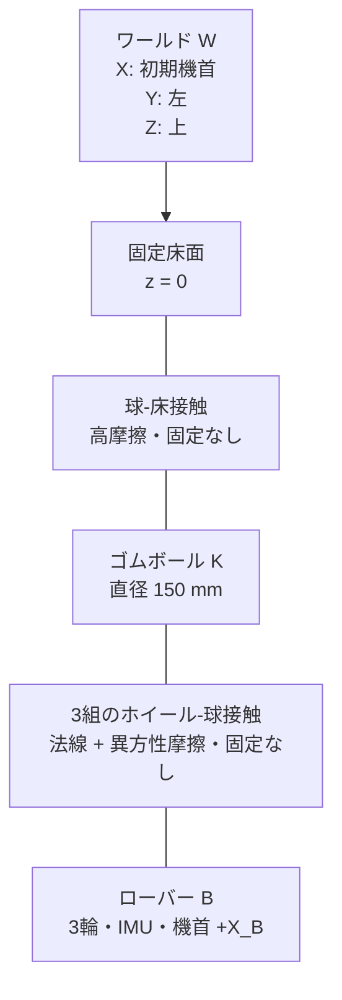
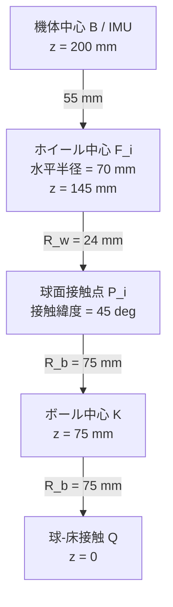

# 玉乗り3WDオムニローバー機構仕様

## システム構成

## 座標系

| 記号 | 原点 | 軸 |
|---|---|---|
| $W$ | 床面基準 | $+X_W$: 初期機首、$+Y_W$: 左、$+Z_W$: 上 |
| $B$ | 機体中央のIMU | $+X_B$: 機首、$+Y_B$: 左、$+Z_B$: 上 |
| $K$ | ボール中心 | 初期状態で $W$ と平行 |
| $F_i$ | ホイール $i$ 中心 | $+Z_{F_i}$: 車軸、$+X_{F_i}$: 駆動転動方向 |

## 初期配置

| 量 | 記号 | 値 | 単位 |
|---|---:|---:|---:|
| ボール半径 | $R_b$ | 0.075 | m |
| ホイール半径 | $R_w$ | 0.024 | m |
| ホイール接触緯度 | $\lambda$ | 45 | deg |
| ホイール方位角 | $\beta_i$ | 0, 120, 240 | deg |
| ボール中心から機体中心までの高さ | $h_B$ | 0.125 | m |
| 機体中心初期座標 | ${}^Wp_B$ | $[0,0,0.200]^T$ | m |
| 機体初期姿勢 | $[\phi_0,\theta_0,\psi_0]^T$ | $[0,0,0]^T$ | deg |

$$
{}^Bn_i=
\begin{bmatrix}
\cos\lambda\cos\beta_i\\
\cos\lambda\sin\beta_i\\
\sin\lambda
\end{bmatrix},\quad
{}^Bt_i=
\begin{bmatrix}
-\sin\beta_i\\
\cos\beta_i\\
0
\end{bmatrix},\quad
{}^Ba_i={}^Bn_i\times{}^Bt_i
$$

$$
{}^Bp_{F_i}=(R_b+R_w){}^Bn_i-
\begin{bmatrix}0\\0\\h_B\end{bmatrix}
$$

| 派生寸法 | 値 |
|---|---:|
| ホイール中心の水平配置半径 $(R_b+R_w)\cos\lambda$ | 70.0 mm |
| ホイール中心のボール中心からの高さ $(R_b+R_w)\sin\lambda$ | 70.0 mm |
| ホイール中心の機体中心からの下がり量 | 55.0 mm |
| 機体外接半径 | 80.0 mm |

## 構成部品

| 部位 | 採用品 | 数量 | 主要仕様 | モデル値の出典 |
|---|---|---:|---|---|
| ボール | ジュニア新体操用150 mmゴムボール（使用候補） | 1 | 直径150 mm、十分な表面摩擦 | 候補品実測前。質量0.300 kgを仮定 |
| オムニホイール | Nexus Robot 14108 | 3 | 直径48 mm、幅25.1 mm、8ローラー、約39–40 g、負荷上限2 kg | [14108仕様書](../omnirover3wd_reference/omniwheel_14108/nexus_14108_omniwheel_datasheet.pdf) |
| サーボ | Nexus Robot 16007 / RB-Nex-40 | 3 | 41.7 × 19.7 × 42.9 mm、55 g、13 kgf·cm、53–62 rpm、3–7.2 V | [16007仕様書](../omnirover3wd_reference/servo_16007/nexus_16007_servo_datasheet.pdf) |
| IMU | 理想6軸IMU | 1 | 3軸比力、3軸角速度、機体中央配置 | シミュレーションセンサー |
| エンコーダー | 理想車輪軸エンコーダー | 3 | 各輪回転変位（回転速度は制御器内で微分） | シミュレーションセンサー |

## 質量・慣性予算

| 構成 | 単体質量 | 数量 | 小計 |
|---|---:|---:|---:|
| 機体フレーム・電装・支持部 | 0.180 kg | 1 | 0.180 kg |
| 16007サーボ | 0.055 kg | 3 | 0.165 kg |
| 14108ホイール | 0.039 kg | 3 | 0.117 kg |
| ローバー合計 |  |  | 0.462 kg |
| 150 mmゴムボール（モデル仮定） | 0.300 kg | 1 | 0.300 kg |

$$
I_b=\frac{2}{3}m_bR_b^2I_3
=1.125\times10^{-3}I_3\ \mathrm{kg\,m^2}
$$

## 接触仕様

| 接触 | 法線モデル | 接線モデル | 分離 |
|---|---|---|---|
| ボール–床 | $F_n=s(d,w)(k_nd+c_n\dot d)$ | Smooth stick-slip、$\mu_s=0.90$、$\mu_d=0.80$ | 可能 |
| ホイール–ボール | $F_{n,i}=s(d_i,w)(k_nd_i+c_n\dot d_i)$ | 駆動方向 $\mu_d=0.75$、ローラー方向 $\mu_r=0.02$ | 可能 |

| パラメーター | ホイール–ボール | ボール–床 | 単位 |
|---|---:|---:|---:|
| 法線剛性 | $2.0\times10^5$ | $3.0\times10^5$ | N/m |
| 法線減衰 | 250 | 180 | N/(m/s) |
| 遷移幅 | $5.0\times10^{-4}$ | $5.0\times10^{-4}$ | m |
| 臨界すべり速度 | $5.0\times10^{-3}$ | $5.0\times10^{-3}$ | m/s |

## 駆動制約

$$
\tau_{servo,max}=13\times\frac{9.80665}{100}=1.275\ \mathrm{N\,m}
$$

$$
N_{i,nom}=\frac{m_Rg}{3\sin\lambda}=2.137\ \mathrm{N},\qquad
\tau_{contact,max}=\mu_dN_{i,nom}R_w=0.0384\ \mathrm{N\,m}
$$

| 制約 | 下限 | 上限 | 支配要因 |
|---|---:|---:|---|
| 連続輪速 | -5.55 rad/s | 5.55 rad/s | 53 rpmを保守値として採用 |
| 短時間輪速 | -6.49 rad/s | 6.49 rad/s | 62 rpm |
| 指令輪トルク | -0.0384 N·m | 0.0384 N·m | 公称接触摩擦 |
| サーボ軸物理上限 | -1.275 N·m | 1.275 N·m | 16007仕様 |

## センサー・配線インターフェース

| ID | 位置 | 出力 | 単位 | 正方向 |
|---|---|---|---|---|
| IMU | $B$ 原点 | $[f_x,f_y,f_z,p,q,r]$ | m/s², rad/s | $B$ 軸右手系 |
| ENC1 | $F_1$ 車軸 | $\omega_1$ | rad/s | $+a_1$ |
| ENC2 | $F_2$ 車軸 | $\omega_2$ | rad/s | $+a_2$ |
| ENC3 | $F_3$ 車軸 | $\omega_3$ | rad/s | $+a_3$ |

## 製作・受入条件

| ID | 条件 | 受入値 |
|---|---|---:|
| M-01 | 3輪方位角誤差 | ±0.5 deg以内 |
| M-02 | 接触緯度誤差 | ±1.0 deg以内 |
| M-03 | 3接触点の半径方向位置差 | 0.5 mm以内 |
| M-04 | IMU原点と機体幾何中心のずれ | 1.0 mm以内 |
| M-05 | 機首マーキングと $+X_B$ のずれ | ±0.5 deg以内 |
| M-06 | ボール直径 | 150 mm ±2 mm |
| M-07 | ボール質量・慣性 | 組込み前に実測しモデル更新 |
| M-08 | 静止時3輪法線荷重差 | 平均の±10%以内 |

## 参照

| 資料 | 用途 |
|---|---|
| [オムニローバー3WD駆動部品資料](../omnirover3wd_reference/README.md) | 採用ホイール・サーボの型番確認 |
| [MathWorks: Spatial Contact Force](https://www.mathworks.com/help/sm/ref/spatialcontactforce.html) | ペナルティ接触、分離、接触量計測 |
| [Lalほか: Hardware and control design of a ball balancing robot](https://busoniu.net/files/papers/ddecs19.pdf) | 3輪・球・車体の機構構成 |
