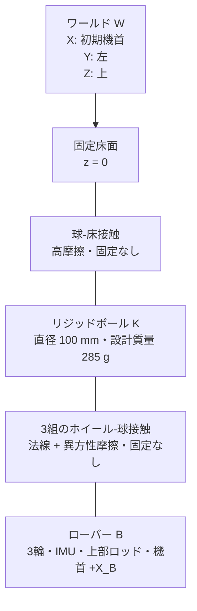
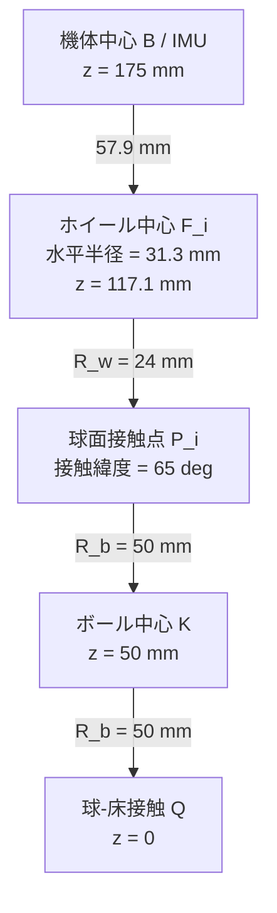

# 玉乗り3WDオムニローバー機構仕様

## システム構成

## 座標系

| 記号 | 原点 | 軸 |
|---|---|---|
| $W$ | 床面基準 | $+X_W$: 初期機首、$+Y_W$: 左、$+Z_W$: 上 |
| $B$ | 機体中央のIMU | $+X_B$: 機首、$+Y_B$: 左、$+Z_B$: 上 |
| $K$ | ボール中心 | 初期状態で $W$ と平行 |
| $F_i$ | ホイール $i$ 中心 | $+Z_{F_i}$: 車軸、$+X_{F_i}$: 駆動転動方向 |

## 初期配置

| 量 | 記号 | 値 | 単位 |
|---|---:|---:|---:|
| ボール半径 | $R_b$ | 0.050 | m |
| ホイール半径 | $R_w$ | 0.024 | m |
| ホイール接触緯度 | $\lambda$ | 65 | deg |
| ホイール方位角 | $\beta_i$ | 0, 120, 240 | deg |
| 車軸回転角 | $\phi$ | 0 | deg |
| ボール中心から機体中心までの高さ | $h_B$ | 0.125 | m |
| 機体中心初期座標 | ${}^Wp_B$ | $[0,0,0.175]^T$ | m |
| 機体初期姿勢 | $[\phi_0,\theta_0,\psi_0]^T$ | $[0,0,0]^T$ | deg |
| 上部ロッド長さ | $L_p$ | 0.300 | m |
| 上部ロッド断面 | $w_p\times w_p$ | $0.020\times0.020$ | m |
| 上部ロッド中心の機体原点からの高さ | $h_p$ | 0.165 | m |
| ローバー合成重心の球中心からの高さ | $h_{COM}$ | 0.2010 | m |

$$
{}^Bn_i=
\begin{bmatrix}
\cos\lambda\cos\beta_i\\
\cos\lambda\sin\beta_i\\
\sin\lambda
\end{bmatrix},\quad
{}^Bt_i=
\begin{bmatrix}
-\sin\beta_i\\
\cos\beta_i\\
0
\end{bmatrix},\quad
{}^Ba_i={}^Bn_i\times{}^Bt_i
$$

車軸方向は $a_i=n_i\times t_i$（$\phi=0$ の同軸配置）とし、モータは車輪中心から外向き（$-a_i$ 方向）に延びる。高緯度化するとホイール中心の水平半径 $(R_b+R_w)\cos\lambda$ が縮小する一方、外向きモータの先端半径が支配的になる。$\lambda$ を上げると隣接ホイール間の隙間が $\sqrt3(R_b+R_w)\cos\lambda-2R_w$ で縮小し、$\lambda=68^\circ$ でリム同士が接触する。印刷公差と組立性を考慮し、隙間約4.7 mmが残る $\lambda=65^\circ$ を採用した（$\lambda=66^\circ$ では隙間約2.9 mmまで減るのに対し外形は約2 mmしか縮まない）。

$$
{}^Bp_{F_i}=(R_b+R_w){}^Bn_i-
\begin{bmatrix}0\\0\\h_B\end{bmatrix}
$$

| 派生寸法 | 値 |
|---|---:|
| ホイール中心の水平配置半径 $(R_b+R_w)\cos\lambda$ | 31.3 mm |
| ホイール中心のボール中心からの高さ $(R_b+R_w)\sin\lambda$ | 67.1 mm |
| ホイール中心の機体中心からの下がり量 | 57.9 mm |
| 隣接ホイール間クリアランス | 約4.7 mm |
| 機体最大外形半径（モータ先端角部） | 107.6 mm（直径 215 mm） |
| モータフェース位置（車軸方向 $s$） | -20.6 mm |

## 構成部品

| 部位 | 採用品 | 数量 | 主要仕様 | モデル値の出典 |
|---|---|---:|---|---|
| ボール | リジッドボール XL（設計基準） | 1 | 直径100 mm、質量285 g、高グリップ表面 | 公開仕様。直径、質量、慣性、摩擦は入手後に実測 |
| オムニホイール | Nexus Robot 14108 | 3 | 直径48 mm、幅25.1 mm、8ローラー、約39–40 g、負荷上限2 kg | [14108仕様書](../omnirover3wd_reference/omniwheel_14108/nexus_14108_omniwheel_datasheet.pdf) |
| DCギヤードモータ | DFRobot FIT0521 | 3 | 6 V、210 rpm、10 kgf·cm、ストール3.2 A、52 × $\phi$24.4 mm、96 g | [DFRobot公式仕様](https://wiki.dfrobot.com/fit0521/) |
| モータドライバ | Cytron MDD3A | 2 | 2チャネル/枚、4–16 V、3 A連続・5 Aピーク/チャネル、PWM最大20 kHz、PWM/DIR入力 | [Cytron公式仕様](https://my.cytron.io/p-3amp-4v-16v-dc-motor-driver-2-channels) |
| IMU | 理想6軸IMU | 1 | 3軸比力、3軸角速度、機体中央配置 | シミュレーションセンサー |
| エンコーダー | FIT0521内蔵2相Hall | 3 | 3.3/5 V、出力軸341.2 PPR、各輪回転変位（回転速度は制御器内で微分） | DFRobot公式仕様。実機のカウント逓倍方式は受入試験で確定 |
| 上部ロッド | 角柱バラスト | 1 | 質量0.500 kg、長さ300 mm、断面20 mm角、機体上面中央へ剛体固定 | `ball_balancing_omni3_multibody_lqi_custom_contact_fullplant.slx` の正式仕様 |
| フレーム L1 | 3Dプリント円板 Ø160×3 mm | 1 | 中央穴Ø20、スペーサM4穴6、モータマウントM4穴4×3組 | `cad/parts/Frame_L1.step/.stl` |
| フレーム L2 / L3 | 3Dプリント円板 Ø160×3 mm | 各1 | スペーサM4穴6 | `cad/parts/Frame_L2.step/.stl`, `Frame_L3.step/.stl` |
| スペーサ | M4×50 mm 六角スペーサ相当 | 12 | 2段×6本、L1–L2間とL2–L3間 | `cad/parts/Spacer_M4x50.step/.stl` |
| モータマウント | MotorMount_v9（3Dプリント） | 3 | 最小面数の解析形状（46面・単一ボディ）。Frame_L1下面に接する水平パッド＋2本脚＋車軸方向に傾斜したクレイドルブロック＋ギアボックス前面壁板の一体成型ポータル構造。クレイドル溝Ø25.4（ギアボックス胴体Ø25へ半径0.2 mm隙間）でモーターをギアボックス側開口から挿入・支持。壁板はモータ軸に垂直で、中央にØ7出力軸ボア、周囲にØ3.4すきま穴×4（ギアボックス前面M3タップPCD17と同軸、ボルト＋ワッシャー締結）。フレームL1との締結は水平パッドの4×Ø4.5貫通穴（r=57/64、y=±9、L1のØ4.2穴と一致）でナット＋ボルト式。クレイドル座面にØ4.6インサートポケット×4 | `cad/parts/MotorMount_v9.step/.stl` |
| モータクランプ | MotorClampStrap_v1（3Dプリント） | 3 | 15面・単一ボディのクランプストラップ。モーター冠部を0.1 mm隙間で覆い、Ø3.4貫通穴×4からM3ねじでブラケットのインサートポケットへ締結し胴体を押さえる | `cad/parts/MotorClampStrap_v1.step/.stl` |
| ホイールアダプタ | WheelAdapter_v4（3Dプリント） | 3 | Ø11.9スリーブ（ホイールボアØ12に全幅係合）、ボアØ4.1（FIT0521軸Ø4 Dカット→ホイールボアØ12変換）。ギアボックス壁板–ホイール間の約8 mm隙間に配置 | `cad/parts/WheelAdapter_v4.step/.stl` |

## 質量・慣性予算

| 構成 | 単体質量 | 数量 | 小計 |
|---|---:|---:|---:|
| 機体フレーム・電装・支持部（下記内訳） | 0.604 kg | 1 | 0.604 kg |
| FIT0521モータ | 0.096 kg | 3 | 0.288 kg |
| 14108ホイール | 0.039 kg | 3 | 0.117 kg |
| 上部ロッド | 0.500 kg | 1 | 0.500 kg |
| ローバー合計 |  |  | 1.509 kg |
| 100 mmリジッドボール（設計基準） | 0.285 kg | 1 | 0.285 kg |

機体フレーム・電装・支持部 0.604 kg の内訳（`ball_balancing_omnirover3wd_assembly` の構造を簡易再現、フレーム素材はすべてABS ρ=1.05 g/cm³、部品質量はSTEPソリッド体積換算）：

| 部品 | 質量 | 配置高さ（床面基準） |
|---|---:|---|
| フレーム L1/L2/L3 Ø160×3 | 63.3 g ×3 | z = 148.5 / 201.5 / 254.5 mm |
| スペーサ M4×50 | 1.2 g ×12 | r = 65 mm、2段 |
| MotorMount_v9 | 46.8 g ×3 | 重心 z ≈ 110 mm |
| MotorClampStrap_v1 | 3.0 g ×3 | 重心 z ≈ 112 mm |
| バッテリー（L1搭載、代表値） | 120 g | z ≈ 156 mm |
| MDD3A ×2（L1搭載） | 30 g | z ≈ 153 mm |
| Nucleo+IKS4A1（L2搭載） | 90 g | z ≈ 206 mm |
| 配線・その他 | 10 g | z ≈ 160 mm |

上部ロッドを含むローバー合成重心は球中心から161.1 mm上方（機体原点から36.1 mm上方）に位置する。シャーシ集中質量の慣性はモーメント [2.18e-3, 2.18e-3, 1.86e-3] kg·m²（自身重心まわり、球中心からの重心高117.5 mm）でモデル化する。LQI設計には合成重心高と合成傾斜慣性（重心まわり 1.91e-2 kg·m²）を使用し、ホイール配置には機体原点の幾何高さ125 mmを使用する。

$$
I_b=\frac{2}{3}m_bR_b^2I_3
=4.750\times10^{-4}I_3\ \mathrm{kg\,m^2}
$$

慣性は薄肉球殻を保守側の初期値としている。実物の内部質量分布を同定し、一様中実球相当$2.85\times10^{-4}I_3\ \mathrm{kg\,m^2}$との範囲で制御ロバスト性を確認する。

## 接触仕様

| 接触 | 法線モデル | 接線モデル | 分離 |
|---|---|---|---|
| ボール–床 | $F_n=s(d,w)(k_nd+c_n\dot d)$ | Smooth stick-slip、$\mu_s=0.90$、$\mu_d=0.80$ | 可能 |
| ホイール–ボール | $F_{n,i}=s(d_i,w)(k_nd_i+c_n\dot d_i)$ | 駆動方向 $\mu_d=0.75$、ローラー方向 $\mu_r=0.02$ | 可能 |

| パラメーター | ホイール–ボール | ボール–床 | 単位 |
|---|---:|---:|---:|
| 法線剛性 | $2.0\times10^5$ | $3.0\times10^5$ | N/m |
| 法線減衰 | 250 | 180 | N/(m/s) |
| 遷移幅 | $5.0\times10^{-4}$ | $5.0\times10^{-4}$ | m |
| 臨界すべり速度 | $5.0\times10^{-3}$ | $5.0\times10^{-3}$ | m/s |

## 駆動制約

$$
\tau_{motor,stall}=10\times\frac{9.80665}{100}=0.981\ \mathrm{N\,m}
$$

$$
\tau_{continuous}=\tau_{motor,stall}\frac{3.0}{3.2}=0.919\ \mathrm{N\,m}
$$

$$
N_{i,nom}=\frac{m_Rg}{3\sin\lambda}=5.443\ \mathrm{N},\qquad
\tau_{contact,max}=\mu_dN_{i,nom}R_w=0.0980\ \mathrm{N\,m}
$$

| 制約 | 下限 | 上限 | 支配要因 |
|---|---:|---:|---|
| 無負荷輪速 | -21.99 rad/s | 21.99 rad/s | FIT0521、210 rpm @ 6 V |
| 連続指令輪トルク | -0.919 N·m | 0.919 N·m | MDD3A 3 A連続定格をFIT0521のトルク定数へ換算 |
| 短時間軸トルク | -0.981 N·m | 0.981 N·m | FIT0521ストールトルク。連続運転には使用しない |
| PWM周波数 | 0 kHz | 20 kHz | MDD3A入力上限 |

## センサー・配線インターフェース

| ID | 位置 | 出力 | 単位 | 正方向 |
|---|---|---|---|---|
| IMU | $B$ 原点 | $[f_x,f_y,f_z,p,q,r]$ | m/s², rad/s | $B$ 軸右手系 |
| ENC1 | $F_1$ 車軸 | $\omega_1$ | rad/s | $+a_1$ |
| ENC2 | $F_2$ 車軸 | $\omega_2$ | rad/s | $+a_2$ |
| ENC3 | $F_3$ 車軸 | $\omega_3$ | rad/s | $+a_3$ |

MDD3Aは2チャネル品であるため、基板Aのチャネル1/2をM1/M2、基板Bのチャネル1をM3へ割り当て、基板Bのチャネル2は未使用とする。モータ電源は6 V、ロジックGND・エンコーダGND・MDD3A GNDは共通化する。各モータのPWMとDIRは独立信号とし、非常停止では全PWMを0へ設定する。

## 製作・受入条件

| ID | 条件 | 受入値 |
|---|---|---:|
| M-01 | 3輪方位角誤差 | ±0.5 deg以内 |
| M-02 | 接触緯度誤差 | ±1.0 deg以内 |
| M-03 | 3接触点の半径方向位置差 | 0.5 mm以内 |
| M-04 | IMU原点と機体幾何中心のずれ | 1.0 mm以内 |
| M-05 | 機首マーキングと $+X_B$ のずれ | ±0.5 deg以内 |
| M-06 | ボール直径 | 100 mm。3軸測定値と真球度を記録 |
| M-07 | ボール質量・慣性 | 組込み前に実測しモデル更新 |
| M-08 | 静止時3輪法線荷重差 | 平均の±10%以内 |
| M-09 | ホイール、締結部、配線を含む最大外形 | 直径216 mm以内（同軸外向き配置の実質下限、モータ先端が支配） |
| M-10 | FIT0521出力軸1回転のエンコーダーカウント | 341.2 PPR公称値との誤差を記録し、x1/x2/x4デコード方式を確定 |
| M-11 | MDD3A連続電流 | 各使用チャネル3.0 A以下 |
| M-12 | 上部ロッド質量 | $0.500\ \mathrm{kg}$、実測値を記録 |
| M-13 | 上部ロッド長さ・断面 | $300\ \mathrm{mm}$、$20\times20\ \mathrm{mm}$ |
| M-14 | 上部ロッド中心軸と$+Z_B$の傾き | ±0.5 deg以内 |

## CADアセンブリ

Fusion 360 プロジェクト `nenecchi/ball-balancing-omni-rover` 内の `ball_balancing_omnirover3wd_assembly`。32オカレンス。全オカレンスは数値検証済みの配置で接地固定し、モータ3個・MotorMount_v9の3オカレンス・MotorClampStrap_v1の3オカレンスを含む。ボールキャスターは廃止した。エクスポートは `cad/ball_balancing_omnirover3wd_assembly.f3d` / `.step`、個別部品は `cad/parts/`（STEP＋STL）。

### レイアウト（Z上向き、単位 mm）

| 部品 | 位置 |
|---|---|
| ボール Ø100 | 中心 z = 50、球-床接触 z = 0 |
| ホイール中心 $F_i$ | 水平半径 31.3、z = 117.1、方位 0/120/240 deg |
| 車軸 $a_i$ | $\phi=0$（同軸）。ホイール平坦面は $-a_i$ 側（モータ側） |
| モータ | フェース $s=-20.6$ mm（外向き・下向き、水平面に対し約25 deg）、先端は機体半径方向最大外形を形成 |
| フレーム L1 | Ø160×3、z = 147–150 |
| フレーム L2 / L3 | Ø160×3、z = 200–203 / 253–256 |
| スペーサ M4×50 | r = 65、6方位×2段 |

### 3Dプリント設計メモ

- MotorMount_v9 は面数最小化を目的に、水平パッド・2本脚・傾斜クレイドルブロック・ギアボックス壁板と各種円柱切削のみで構成した解析形状（46面・単一ボディ）とした。一体成型可能なポータル構造で、モーターはホイール側（ギアボックス側）の開口からクレイドル溝Ø25.4へ挿入する。壁板はモータ軸に垂直で、中央にØ7出力軸ボア、周囲にØ3.4すきま穴×4を持つ。モーター後端のエンコーダー・コネクタ非対称張り出し部は溝の開口側を向き非拘束とする（このためモーターは出力軸回りに180°回転した向きで搭載する）。
- 締結仕様：フレームL1との固定のみ水平パッド（L1下面と平行な板）の4×Ø4.5貫通穴（r = 57/64、y = ±9、L1のØ4.2穴に整合）でM4ナット＋ボルト式とし、それ以外のねじ穴はすべて熱圧入インサート前提とした。ギアボックス締結は壁板のØ3.4穴越しにM3ボルト＋ワッシャーを通してモーター前面M3タップ（ボルト円Ø17×4）へ締結する。ボルト頭・ワッシャーは壁板とホイールアダプタの間（約8 mm）に収まり、穴周囲は平坦面でワッシャーを挟める。ストラップ締結はクレイドル座面のØ4.6ポケットへM3インサートを圧入し、ストラップのØ3.4貫通穴からM3ねじで締結する。
- MotorClampStrap_v1 は15面の平板状ストラップで、モーター冠部を0.1 mm隙間で覆い、締結時に冠部リブへ押さえ代（プリロード）を与える。
- WheelAdapter_v4 はØ11.9スリーブ（ホイールボアØ12に全幅係合）＋ボアØ4.1。ギアボックス壁板のØ7ボアを通ったØ4出力軸に係合する。
- 穴は印刷後のリーマ・ドリル通しを想定しM3パイロット→Ø3.4、M4（ナット＋ボルト式）→Ø4.5、ボアØ4.1とした。インサート穴Ø4.6（M3用）はインサート品種に応じて微調整する。

### 検証結果

- 全ポッド×全ペアのワールド空間干渉チェック（Fusion BRepブール演算）：実質干渉なし（ブラケット–モータ・軸・アダプタ・ホイール・フレームL1・ボール、ストラップ–軸・アダプタ・ホイールすべて0 mm³、3ユニット同一結果）。残存はストラップ–モーター 8.9 mm³（冠部リブへの押さえ代、設計上のプリロード）とストラップ–ブラケット 34.7 mm³（座面の座り代、平均約0.04 mm）の締結部接触のみ
- 最大外形：半径 107.6 mm（直径215 mm、M-09適合）。支配するのはモータ先端角部
- 全高：約257 mm
- ホイール–ボール：車軸中心誤差 0.00 mm、トレッド面がボールに接線接触（$\lambda=65^\circ$）
- 隣接ホイール間クリアランス：約4.7 mm
- モータギアボックスØ25：クレイドル溝Ø25.4へ挿入（半径0.2 mm隙間）。壁板Ø3.4穴×4がモータM3タップ（ボルト円Ø17、±8.5 mm）と同軸
- ストラップ締結：ストラップØ3.4穴×4がブラケットのØ4.6インサートポケットと同軸
- フレームL1締結：水平パッドの4×Ø4.5貫通穴がL1のØ4.2穴（r = 57/64、y = ±9）と一致、パッド上面はL1下面に面一
- モータ軸：Ø4×12 mm Dカット軸が壁板Ø7ボアを通りアダプタボアØ4.1へ係合

## 機構変更の影響

FIT0521は従来サーボと外形、出力軸、取付方法が異なるため、既存のRotramaサーボマウント用CADは製作用として使用しない。本設計は $\phi=0$ の同軸配置でモータを車輪中心から外向き（$-a_i$ 方向）に延ばす構成とし、車軸回転の影響（駆動方向の接線からのずれ、ヨー制御権低下）を排除した。駆動方向は水平接線 $w_i=a_i\times n_i$ のままなので、従来の車輪速度–ボール角速度マッピングをそのまま適用できる。

同軸外向き配置ではFIT0521（全長61 mm）が機体半径方向に大きく延びるため、Ø160 mm包絡は物理的に成立しない（理論下限でも車輪3個が天頂に集まる$\lambda=90^\circ$で約Ø185 mm）。そこで包絡緩和を許容し、隣接ホイール間クリアランス約4.7 mmが残る最大緯度 $\lambda=65^\circ$ を採用して最小実用外形 Ø215 mm とした。$\lambda\ge66^\circ$ ではクリアランスが3 mmを切り印刷誤差・リム変形の余裕が不足する。フレーム板はØ160 mmを維持し、外形を超えるのはモータ・ホイール・マウントのみである。

各モータポッドはMotorMount_v9ブラケット経由でFrame_L1へ片持ち締結する構成とし、従来検討していたボールキャスターによるボール面の第2接点支持は廃止した。モーターの保持はギアボックス前面M3タップへの壁板ボルト締結＋クランプストラップの締め付けで担う。

FIT0521向けのモーター固定パーツ（MotorMount_v9ブラケット＋MotorClampStrap_v1ストラップ）はFusion 360アセンブリ内で設計・検証済み（詳細は `cad/fit0521_motor_mount_report.md`）。この配置での最大外形は直径215 mmでM-09（216 mm以内）を満たす。

## 参照

| 資料 | 用途 |
|---|---|
| [DFRobot FIT0521](https://wiki.dfrobot.com/fit0521/) | モータ、エンコーダー、外形の公称仕様 |
| [Cytron MDD3A](https://my.cytron.io/p-3amp-4v-16v-dc-motor-driver-2-channels) | 電源、チャネル、電流、PWM仕様 |
| [MathWorks: Spatial Contact Force](https://www.mathworks.com/help/sm/ref/spatialcontactforce.html) | ペナルティ接触、分離、接触量計測 |
| [Lalほか: Hardware and control design of a ball balancing robot](https://busoniu.net/files/papers/ddecs19.pdf) | 3輪・球・車体の機構構成 |
