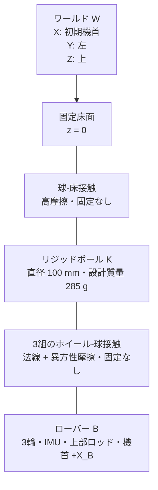
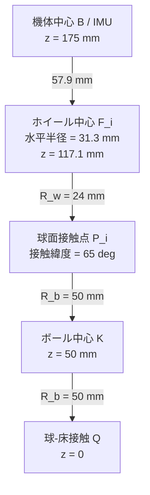

# 玉乗り3WDオムニローバー機構仕様

## システム構成

## 座標系

| 記号 | 原点 | 軸 |
|---|---|---|
| $W$ | 床面基準 | $+X_W$: 初期機首、$+Y_W$: 左、$+Z_W$: 上 |
| $B$ | 機体中央のIMU | $+X_B$: 機首、$+Y_B$: 左、$+Z_B$: 上 |
| $K$ | ボール中心 | 初期状態で $W$ と平行 |
| $F_i$ | ホイール $i$ 中心 | $+Z_{F_i}$: 車軸、$+X_{F_i}$: 駆動転動方向 |

## 初期配置

| 量 | 記号 | 値 | 単位 |
|---|---:|---:|---:|
| ボール半径 | $R_b$ | 0.050 | m |
| ホイール半径 | $R_w$ | 0.024 | m |
| ホイール接触緯度 | $\lambda$ | 65 | deg |
| ホイール方位角 | $\beta_i$ | 0, 120, 240 | deg |
| 車軸回転角 | $\phi$ | 0 | deg |
| ボール中心から機体中心までの高さ | $h_B$ | 0.125 | m |
| 機体中心初期座標 | ${}^Wp_B$ | $[0,0,0.175]^T$ | m |
| 機体初期姿勢 | $[\phi_0,\theta_0,\psi_0]^T$ | $[0,0,0]^T$ | deg |
| 上部ロッド長さ | $L_p$ | 0.300 | m |
| 上部ロッド断面 | $w_p\times w_p$ | $0.020\times0.020$ | m |
| 上部ロッド中心の機体原点からの高さ | $h_p$ | 0.165 | m |
| ローバー合成重心の球中心からの高さ | $h_{COM}$ | 0.2010 | m |

$$
{}^Bn_i=
\begin{bmatrix}
\cos\lambda\cos\beta_i\\
\cos\lambda\sin\beta_i\\
\sin\lambda
\end{bmatrix},\quad
{}^Bt_i=
\begin{bmatrix}
-\sin\beta_i\\
\cos\beta_i\\
0
\end{bmatrix},\quad
{}^Ba_i={}^Bn_i\times{}^Bt_i
$$

車軸方向は $a_i=n_i\times t_i$（$\phi=0$ の同軸配置）とし、モータは車輪中心から外向き（$-a_i$ 方向）に延びる。高緯度化するとホイール中心の水平半径 $(R_b+R_w)\cos\lambda$ が縮小する一方、外向きモータの先端半径が支配的になる。$\lambda$ を上げると隣接ホイール間の隙間が $\sqrt3(R_b+R_w)\cos\lambda-2R_w$ で縮小し、$\lambda=68^\circ$ でリム同士が接触する。印刷公差と組立性を考慮し、隙間約4.7 mmが残る $\lambda=65^\circ$ を採用した（$\lambda=66^\circ$ では隙間約2.9 mmまで減るのに対し外形は約2 mmしか縮まない）。

$$
{}^Bp_{F_i}=(R_b+R_w){}^Bn_i-
\begin{bmatrix}0\\0\\h_B\end{bmatrix}
$$

| 派生寸法 | 値 |
|---|---:|
| ホイール中心の水平配置半径 $(R_b+R_w)\cos\lambda$ | 31.3 mm |
| ホイール中心のボール中心からの高さ $(R_b+R_w)\sin\lambda$ | 67.1 mm |
| ホイール中心の機体中心からの下がり量 | 57.9 mm |
| 隣接ホイール間クリアランス | 約4.7 mm |
| 機体最大外形半径（モータ先端角部） | 107.6 mm（直径 215 mm） |
| モータフェース位置（車軸方向 $s$） | -20.6 mm |

## 構成部品

| 部位 | 採用品 | 数量 | 主要仕様 | モデル値の出典 |
|---|---|---:|---|---|
| ボール | リジッドボール XL（設計基準） | 1 | 直径100 mm、質量285 g、高グリップ表面 | 公開仕様。直径、質量、慣性、摩擦は入手後に実測 |
| オムニホイール | Nexus Robot 14108 | 3 | 直径48 mm、幅25.1 mm、8ローラー、約39–40 g、負荷上限2 kg | [14108仕様書](../omnirover3wd_reference/omniwheel_14108/nexus_14108_omniwheel_datasheet.pdf) |
| DCギヤードモータ | DFRobot FIT0521 | 3 | 6 V、210 rpm、10 kgf·cm、ストール3.2 A、52 × $\phi$24.4 mm、96 g | [DFRobot公式仕様](https://wiki.dfrobot.com/fit0521/) |
| モータドライバ | Cytron MDD3A | 2 | 2チャネル/枚、4–16 V、3 A連続・5 Aピーク/チャネル、PWM最大20 kHz、PWM/DIR入力 | [Cytron公式仕様](https://my.cytron.io/p-3amp-4v-16v-dc-motor-driver-2-channels) |
| IMU | 理想6軸IMU | 1 | 3軸比力、3軸角速度、機体中央配置 | シミュレーションセンサー |
| エンコーダー | FIT0521内蔵2相Hall | 3 | 3.3/5 V、出力軸341.2 PPR、各輪回転変位（回転速度は制御器内で微分） | DFRobot公式仕様。実機のカウント逓倍方式は受入試験で確定 |
| 上部ロッド | 角柱バラスト | 1 | 質量0.500 kg、長さ300 mm、断面20 mm角、機体上面中央へ剛体固定 | `ball_balancing_omni3_multibody_lqi_custom_contact_fullplant.slx` の正式仕様 |
| フレーム L1 | 3Dプリント円板 Ø160×3 mm | 1 | 中央穴Ø20、スペーサM4穴6、モータマウントM4穴4×3組 | `cad/parts/Frame_L1.step/.stl` |
| フレーム L2 / L3 | 3Dプリント円板 Ø160×3 mm | 各1 | スペーサM4穴6 | `cad/parts/Frame_L2.step/.stl`, `Frame_L3.step/.stl` |
| スペーサ | M4×50 mm 六角スペーサ相当 | 12 | 2段×6本、L1–L2間とL2–L3間 | `cad/parts/Spacer_M4x50.step/.stl` |
| モータマウント | MotorMount_v5（3Dプリント） | 3 | フェース板3.6 mm厚＋M3×4＋中央逃げØ9、立ち上がりアーム＋水平フット M4×4でL1下面へ締結（v4のモータ・フレームインターフェース踏襲）、Pololuキャスター取付パッド一体（アーム・ブロック幅28 mmに強化） | `cad/parts/MotorMount_v5.step/.stl` |
| ホイールアダプタ | WheelAdapter_v3（3Dプリント） | 3 | Ø11.9スリーブ（ホイールボアØ12に全幅係合）、ボアØ4.15（FIT0521軸Ø4→ホイールボアØ12変換） | `cad/parts/WheelAdapter_v3.step/.stl` |
| ボールキャスター | Pololu 3/8インチボールキャスター（金属球・成形ハウジング） | 3 | 球Ø9.525 mm、フランジ取付穴Ø2.29（中心から±6.73 mmピッチ）、球心は取付面から+5.31 mm、マウントパッドへ小ねじ締結、球心–ボール心距離55.5 mm（ボール面に約0.7 mmの転がり隙間） | `cad/parts/pololu_ball_caster_375.step`、[寸法図](pololu_ball_caster_375_dim.pdf) |

## 質量・慣性予算

| 構成 | 単体質量 | 数量 | 小計 |
|---|---:|---:|---:|
| 機体フレーム・電装・支持部 | 0.180 kg | 1 | 0.180 kg |
| FIT0521モータ | 0.096 kg | 3 | 0.288 kg |
| 14108ホイール | 0.039 kg | 3 | 0.117 kg |
| 上部ロッド | 0.500 kg | 1 | 0.500 kg |
| ローバー合計（MDD3A基板質量を除く） |  |  | 1.085 kg |
| 100 mmリジッドボール（設計基準） | 0.285 kg | 1 | 0.285 kg |

上部ロッドを含むローバー合成重心は機体原点から76.0 mm上方、球中心から201.0 mm上方に位置する。LQI設計にはこの合成重心高を使用し、ホイール配置には機体原点の幾何高さ125 mmを使用する。

$$
I_b=\frac{2}{3}m_bR_b^2I_3
=4.750\times10^{-4}I_3\ \mathrm{kg\,m^2}
$$

慣性は薄肉球殻を保守側の初期値としている。実物の内部質量分布を同定し、一様中実球相当$2.85\times10^{-4}I_3\ \mathrm{kg\,m^2}$との範囲で制御ロバスト性を確認する。

## 接触仕様

| 接触 | 法線モデル | 接線モデル | 分離 |
|---|---|---|---|
| ボール–床 | $F_n=s(d,w)(k_nd+c_n\dot d)$ | Smooth stick-slip、$\mu_s=0.90$、$\mu_d=0.80$ | 可能 |
| ホイール–ボール | $F_{n,i}=s(d_i,w)(k_nd_i+c_n\dot d_i)$ | 駆動方向 $\mu_d=0.75$、ローラー方向 $\mu_r=0.02$ | 可能 |

| パラメーター | ホイール–ボール | ボール–床 | 単位 |
|---|---:|---:|---:|
| 法線剛性 | $2.0\times10^5$ | $3.0\times10^5$ | N/m |
| 法線減衰 | 250 | 180 | N/(m/s) |
| 遷移幅 | $5.0\times10^{-4}$ | $5.0\times10^{-4}$ | m |
| 臨界すべり速度 | $5.0\times10^{-3}$ | $5.0\times10^{-3}$ | m/s |

## 駆動制約

$$
\tau_{motor,stall}=10\times\frac{9.80665}{100}=0.981\ \mathrm{N\,m}
$$

$$
\tau_{continuous}=\tau_{motor,stall}\frac{3.0}{3.2}=0.919\ \mathrm{N\,m}
$$

$$
N_{i,nom}=\frac{m_Rg}{3\sin\lambda}=3.913\ \mathrm{N},\qquad
\tau_{contact,max}=\mu_dN_{i,nom}R_w=0.0704\ \mathrm{N\,m}
$$

| 制約 | 下限 | 上限 | 支配要因 |
|---|---:|---:|---|
| 無負荷輪速 | -21.99 rad/s | 21.99 rad/s | FIT0521、210 rpm @ 6 V |
| 連続指令輪トルク | -0.919 N·m | 0.919 N·m | MDD3A 3 A連続定格をFIT0521のトルク定数へ換算 |
| 短時間軸トルク | -0.981 N·m | 0.981 N·m | FIT0521ストールトルク。連続運転には使用しない |
| PWM周波数 | 0 kHz | 20 kHz | MDD3A入力上限 |

## センサー・配線インターフェース

| ID | 位置 | 出力 | 単位 | 正方向 |
|---|---|---|---|---|
| IMU | $B$ 原点 | $[f_x,f_y,f_z,p,q,r]$ | m/s², rad/s | $B$ 軸右手系 |
| ENC1 | $F_1$ 車軸 | $\omega_1$ | rad/s | $+a_1$ |
| ENC2 | $F_2$ 車軸 | $\omega_2$ | rad/s | $+a_2$ |
| ENC3 | $F_3$ 車軸 | $\omega_3$ | rad/s | $+a_3$ |

MDD3Aは2チャネル品であるため、基板Aのチャネル1/2をM1/M2、基板Bのチャネル1をM3へ割り当て、基板Bのチャネル2は未使用とする。モータ電源は6 V、ロジックGND・エンコーダGND・MDD3A GNDは共通化する。各モータのPWMとDIRは独立信号とし、非常停止では全PWMを0へ設定する。

## 製作・受入条件

| ID | 条件 | 受入値 |
|---|---|---:|
| M-01 | 3輪方位角誤差 | ±0.5 deg以内 |
| M-02 | 接触緯度誤差 | ±1.0 deg以内 |
| M-03 | 3接触点の半径方向位置差 | 0.5 mm以内 |
| M-04 | IMU原点と機体幾何中心のずれ | 1.0 mm以内 |
| M-05 | 機首マーキングと $+X_B$ のずれ | ±0.5 deg以内 |
| M-06 | ボール直径 | 100 mm。3軸測定値と真球度を記録 |
| M-07 | ボール質量・慣性 | 組込み前に実測しモデル更新 |
| M-08 | 静止時3輪法線荷重差 | 平均の±10%以内 |
| M-09 | ホイール、締結部、配線を含む最大外形 | 直径216 mm以内（同軸外向き配置の実質下限、モータ先端が支配） |
| M-10 | FIT0521出力軸1回転のエンコーダーカウント | 341.2 PPR公称値との誤差を記録し、x1/x2/x4デコード方式を確定 |
| M-11 | MDD3A連続電流 | 各使用チャネル3.0 A以下 |
| M-12 | 上部ロッド質量 | $0.500\ \mathrm{kg}$、実測値を記録 |
| M-13 | 上部ロッド長さ・断面 | $300\ \mathrm{mm}$、$20\times20\ \mathrm{mm}$ |
| M-14 | 上部ロッド中心軸と$+Z_B$の傾き | ±0.5 deg以内 |

## CADアセンブリ

Fusion 360 プロジェクト `nenecchi/ball-balancing-omni-rover` 内の `ball_balancing_omnirover3wd_assembly`。32オカレンス。フレーム・モータ・ホイール間はリジッドおよびリボリュートのアズビルトジョイントで拘束し、購入品のボールキャスター3個は数値検証済みの配置に固定（接地）。エクスポートは `cad/ball_balancing_omnirover3wd_assembly.f3d` / `.step`、個別部品は `cad/parts/`（STEP＋STL）。

### レイアウト（Z上向き、単位 mm）

| 部品 | 位置 |
|---|---|
| ボール Ø100 | 中心 z = 50、球-床接触 z = 0 |
| ホイール中心 $F_i$ | 水平半径 31.3、z = 117.1、方位 0/120/240 deg |
| 車軸 $a_i$ | $\phi=0$（同軸）。ホイール平坦面は $-a_i$ 側（モータ側） |
| モータ | フェース $s=-20.6$ mm（外向き・下向き、水平面に対し約25 deg）、先端は機体半径方向最大外形を形成 |
| ボールキャスター球 Ø9.525 | 球心：水平半径 44.4、z = 83.2（ボール心距離55.5 mm、方位0/120/240 deg）。ハウジングはマウントパッドに締結 |
| フレーム L1 | Ø160×3、z = 147–150 |
| フレーム L2 / L3 | Ø160×3、z = 200–203 / 253–256 |
| スペーサ M4×50 | r = 65、6方位×2段 |

### 3Dプリント設計メモ

- MotorMount_v5 はフェース板3.6 mm（ホイール側を向く）＋立ち上がりアーム＋水平フット（M4×4、r = 57/64、y = ±9）＋キャスター取付パッド一体ブロック。モータ取付面・M3パターン・フットM4位置は v4 と同一。アーム・ブロックは全幅28 mmに強化し、印刷ソケット（薄肉リップの圧入保持）を廃止して市販キャスター締結へ変更した。
- キャスターパッドはPololu 3/8インチキャスターのフランジ面を受ける平面と、取付穴Ø2.29（±6.73 mmピッチ）に対応するねじ穴・パイロットを持つ。締結はM2.5相当の小ねじまたはタッピングねじを想定。
- WheelAdapter_v3 はØ11.9スリーブ（ホイールボアØ12に全幅係合）。ボアØ4.15はモータ軸Ø4を受ける。モータ軸の係合長は約6.8 mm。
- 推奨積層方向：マウントは側面寝かせ（-Y側面をベッド面に）で印刷する。この向きではフェース板・アーム・パッドの主面がすべて垂直壁となり、最大オーバーハングを抑えられる。アダプタは軸を立てて印刷する。
- 穴は印刷後のリーマ・ドリル通しを想定しM3→Ø3.4、M4→Ø4.5、ボアØ4.15とした。キャスター取付穴はねじ径に応じて下穴加工する。

### 検証結果

- 全ペアのワールド空間干渉チェック：実質干渉なし。残存はキャスターフランジとマウントパッドの当たり面のみ（約0.6 mm³、締結で密着する意図した接触）
- 最大外形：半径 107.6 mm（直径215 mm、M-09適合）。支配するのはモータ先端角部
- 全高：約257 mm
- ホイール–ボール：車軸中心誤差 0.00 mm、トレッド面がボールに接線接触（$\lambda=65^\circ$）
- キャスター球–ボール：球心–ボール心距離 55.5 mm（Ø9.525球、ボール面に約0.7 mmの転がり隙間、方位0/120/240 deg）
- 隣接ホイール間クリアランス：約4.7 mm
- マウント–ボール最小クリアランス：約10.5 mm（頂点ベース）。マウント–ホイール：約2.5 mm以上、マウント–モータ胴体：約1.5 mm
- モータフェース–マウントフェース板隙間：0.1 mm。ホイール平坦面–フェース板隙間：約1.05 mm
- モータ軸–アダプタボア係合長：約6.8 mm

## 機構変更の影響

FIT0521は従来サーボと外形、出力軸、取付方法が異なるため、既存のRotramaサーボマウント用CADは製作用として使用しない。本設計は $\phi=0$ の同軸配置でモータを車輪中心から外向き（$-a_i$ 方向）に延ばす構成とし、車軸回転の影響（駆動方向の接線からのずれ、ヨー制御権低下）を排除した。駆動方向は水平接線 $w_i=a_i\times n_i$ のままなので、従来の車輪速度–ボール角速度マッピングをそのまま適用できる。

同軸外向き配置ではFIT0521（全長61 mm）が機体半径方向に大きく延びるため、Ø160 mm包絡は物理的に成立しない（理論下限でも車輪3個が天頂に集まる$\lambda=90^\circ$で約Ø185 mm）。そこで包絡緩和を許容し、隣接ホイール間クリアランス約4.7 mmが残る最大緯度 $\lambda=65^\circ$ を採用して最小実用外形 Ø215 mm とした。$\lambda\ge66^\circ$ ではクリアランスが3 mmを切り印刷誤差・リム変形の余裕が不足する。フレーム板はØ160 mmを維持し、外形を超えるのはモータ・ホイール・マウントのみである。

各モータポッドはL1への片持ち締結に加え、マウントに締結した市販ボールキャスター（Pololu 3/8インチ、Ø9.525球）でボール面を第2接点として支持する。これによりポッド自重とモータ片持ちモーメントの一部がフレームではなくボールへ直接伝わり、フット締結部とモータ軸の負荷を軽減するとともに、ホイール法線荷重が増して駆動トラクションが向上する。キャスターは全方向に自由転動する受動支持であり、駆動自由度を拘束しない。旧設計の印刷ソケット（Ø10裸球圧入）は薄肉リップの積層強度に依存するため廃止し、ねじ締結の購入品へ置き換えた。

## 参照

| 資料 | 用途 |
|---|---|
| [DFRobot FIT0521](https://wiki.dfrobot.com/fit0521/) | モータ、エンコーダー、外形の公称仕様 |
| [Cytron MDD3A](https://my.cytron.io/p-3amp-4v-16v-dc-motor-driver-2-channels) | 電源、チャネル、電流、PWM仕様 |
| [MathWorks: Spatial Contact Force](https://www.mathworks.com/help/sm/ref/spatialcontactforce.html) | ペナルティ接触、分離、接触量計測 |
| [Lalほか: Hardware and control design of a ball balancing robot](https://busoniu.net/files/papers/ddecs19.pdf) | 3輪・球・車体の機構構成 |
